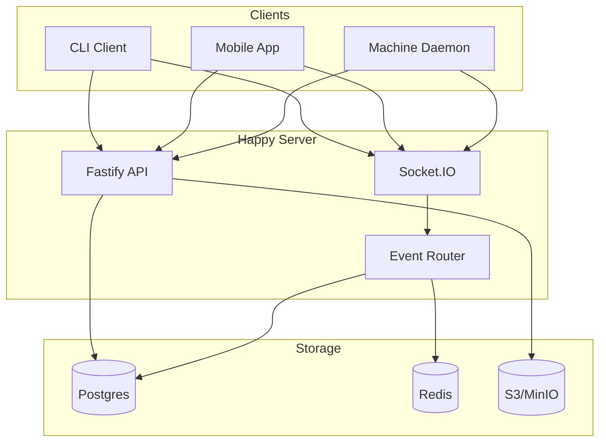
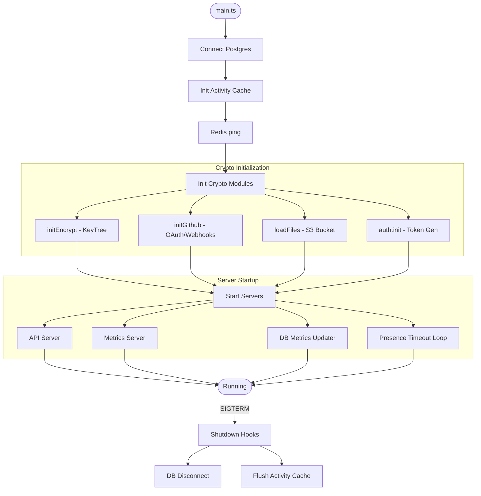
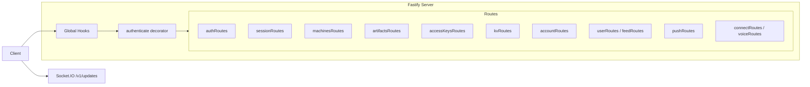
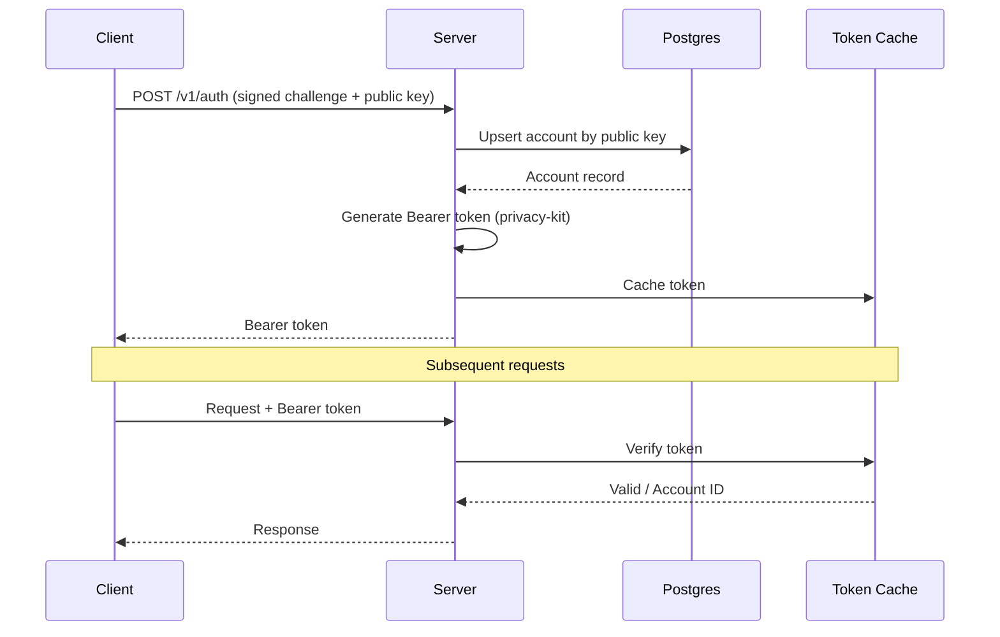
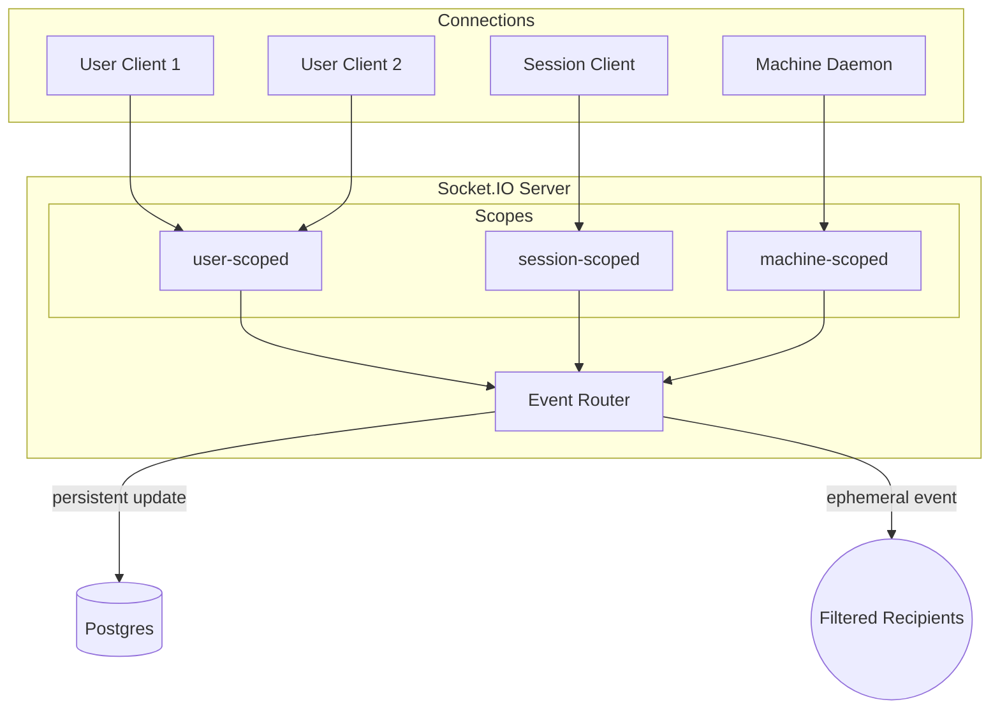
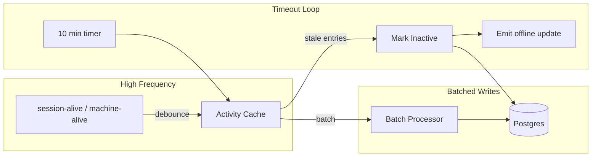
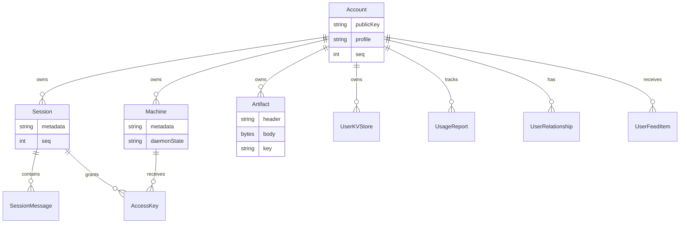
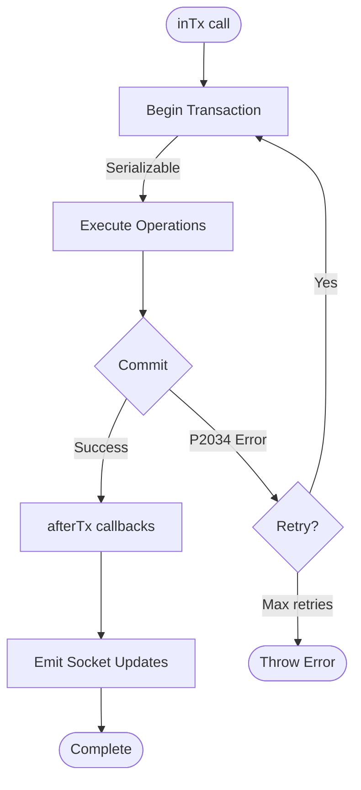
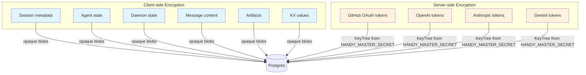

# Backend Architecture

This document describes the Happy backend structure as implemented in `packages/happy-server`. It focuses on how the server is wired, how data flows through the system, and which subsystems handle which responsibilities.

## System overview

## At a glance
- Runtime: Node.js + Fastify for HTTP, Socket.IO for realtime.
- Database: Postgres via Prisma.
- Cache/bus: Redis client is initialized (currently only pinged).
- Blob storage: S3-compatible (MinIO) for uploaded assets.
- Crypto: privacy-kit for auth tokens and encrypted service tokens.
- Metrics: Prometheus-style `/metrics` server + per-request HTTP metrics.

## Process lifecycle
Entry point: `packages/happy-server/sources/main.ts`.

Startup sequence:
1. Connect Postgres (`db.$connect()`).
2. Init activity cache (presence) and Redis connection check (`redis.ping()`).
3. Initialize crypto modules:
   - `initEncrypt()` derives a KeyTree from `HANDY_MASTER_SECRET`.
   - `initGithub()` configures GitHub App/webhooks if env vars exist.
   - `loadFiles()` verifies S3 bucket access.
   - `auth.init()` prepares token generator/verifier.
4. Start API server (`startApi()`), metrics server, database metrics updater, and presence timeout loop.
5. Remain alive until shutdown signal.

Shutdown hooks are registered for DB disconnect and activity-cache flush.

## API layer
`startApi()` in `sources/app/api/api.ts` wires the HTTP server:
- Fastify instance with Zod validators/serializers.
- Global hooks for monitoring and error handling.
- `authenticate` decorator that verifies Bearer tokens.
- Route modules under `sources/app/api/routes`.
- Socket.IO server attached at `/v1/updates`.

HTTP routes are organized by domain:
- Auth (`authRoutes`)
- Sessions + messages (`sessionRoutes`)
- Machines (`machinesRoutes`)
- Artifacts (`artifactsRoutes`)
- Access keys (`accessKeysRoutes`)
- Key-value store (`kvRoutes`)
- Account + usage (`accountRoutes`)
- Social + feed (`userRoutes`, `feedRoutes`)
- Push tokens (`pushRoutes`)
- Integrations (`connectRoutes`, `voiceRoutes`)
- Version checks (`versionRoutes`)
- Dev-only logging (`devRoutes`)

## Authentication and tokens

The backend does not store passwords. Instead:
- Clients authenticate with a signed challenge (`/v1/auth`) using a public key.
- The server upserts the account by public key and returns a Bearer token.
- Tokens are generated and verified by privacy-kit using `HANDY_MASTER_SECRET`.
- Tokens are cached in-memory for fast verification.

GitHub OAuth uses short-lived "ephemeral" tokens to protect the callback and is separate from normal auth.

## Realtime sync architecture

### Connection types
Socket.IO connections are tagged by scope:
- `user-scoped`: receive all user updates.
- `session-scoped`: receive updates only for one session.
- `machine-scoped`: daemon connections for machine state.

### Event router
`EventRouter` (`sources/app/events/eventRouter.ts`) maintains per-user connection sets and routes:
- **Persistent `update` events**: database-backed changes with a user-level monotonic `seq`.
- **Ephemeral events**: presence/usage signals that are not persisted.

The router implements recipient filters so updates go only to interested connections (e.g., all session listeners or a specific machine).

### Update sequence numbers
- `Account.seq` is the per-user update counter. It is incremented by `allocateUserSeq` and used as `UpdatePayload.seq`.
- Sessions and artifacts maintain their own `seq` for per-object ordering.

## Presence and activity

Presence is handled in `sources/app/presence`:
- `session-alive` and `machine-alive` events are debounced in memory (ActivityCache).
- Database writes are batched to reduce write load.
- A timeout loop marks sessions/machines inactive after 10 minutes of silence and emits an offline ephemeral update.

This splits high-frequency presence from durable storage updates.

## Storage and persistence
### Database (Prisma)
Prisma models live in `prisma/schema.prisma`. Key tables:

- `Account`: public key identity, profile, settings, seq counters.
- `Session` + `SessionMessage`: encrypted session metadata and message blobs.
- `Machine`: encrypted machine metadata + daemon state.
- `Artifact`: encrypted header/body + per-artifact key.
- `AccessKey`: encrypted per-session-per-machine access keys.
- `UserKVStore`: encrypted values with optimistic versions.
- `UsageReport`: usage aggregation per session/key.
- `UserRelationship` + `UserFeedItem`: social graph and feed.

### Transactions and retries

`inTx()` wraps Prisma transactions with:
- Serializable isolation.
- Automatic retry on `P2034` (serialization failures).
- `afterTx()` to emit socket updates after commit.

This pattern is used for multi-write operations like batch KV mutation and session deletion.

### Blob storage (S3/MinIO)
The server uses S3-compatible storage for user assets (e.g., avatars):
- `storage/files.ts` configures the S3 client.
- `uploadImage` processes and stores files and writes metadata to `UploadedFile`.
- Public URLs are derived from `S3_PUBLIC_URL`.

### Redis
A Redis client is initialized in `main.ts` and pinged at startup. It can be expanded for caching or pub/sub if needed.

## Data confidentiality model

- Session metadata, agent state, daemon state, and message content are stored as opaque encrypted strings or blobs.
- Artifacts and KV values are stored encrypted and encoded as base64 on the wire.
- The server only encrypts/decrypts **service tokens** (GitHub OAuth tokens, vendor tokens) using the KeyTree derived from `HANDY_MASTER_SECRET`.

## Integrations
- **GitHub**: OAuth connect + webhook verification, optional if env vars are set.
- **AI vendors**: encrypted token storage for `openai`, `anthropic`, `gemini`.
- **Voice**: RevenueCat subscription check + ElevenLabs token minting.
- **Push tokens**: stored for later notification delivery.

## Observability
- `/health` route checks DB connectivity.
- Metrics server exposes `/metrics` for Prometheus.
- HTTP request counters and duration histograms are captured via Fastify hooks.
- WebSocket event counters and connection gauges are in `metrics2.ts`.

## Key implementation references
- Entrypoint: `packages/happy-server/sources/main.ts`
- API server: `packages/happy-server/sources/app/api/api.ts`
- Socket server: `packages/happy-server/sources/app/api/socket.ts`
- Event routing: `packages/happy-server/sources/app/events/eventRouter.ts`
- Presence: `packages/happy-server/sources/app/presence`
- Storage: `packages/happy-server/sources/storage`
- Prisma schema: `packages/happy-server/prisma/schema.prisma`
