# CLI Architecture

This document describes the Happy CLI (`packages/happy-cli`) and its daemon. The CLI is both an interactive tool and a background session manager that keeps machine state in sync with the server.

## Unconfigured synced plugin MCP servers

Claude loads synced plugin MCP definitions independently of Happy's injected
gateway servers. The SDK query adapter excludes blank HTTP/SSE URLs in default
synced plugin configurations using session-only `deniedMcpServers` entries.
It does not edit the sync cache or persist a disabled flag: a URL configured
later must become eligible on the next query. Configured servers, custom
manifest MCP definitions, and ambiguous copies across accounts are left to
the SDK. Revisit this boundary if Claude changes its synced plugin layout or
server naming, or stops loading unconfigured placeholders itself.

## System overview

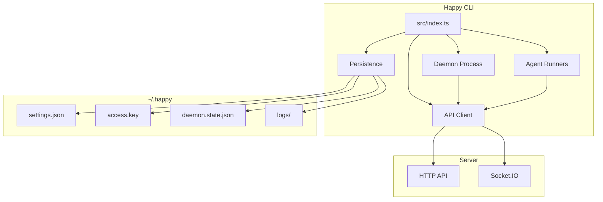

## High-level layout
- **Entry point:** `src/index.ts` parses subcommands and routes execution.
- **API client:** `src/api` handles HTTP + Socket.IO, encryption, and RPC.
- **Daemon:** `src/daemon` runs in the background, spawns sessions, and maintains machine state.
- **Persistence/config:** `src/persistence.ts` + `src/configuration.ts` manage local state in `~/.happy`.
- **Agents:** `src/claude`, `src/codex`, `src/gemini` provide provider-specific runners.

## CLI entry flow

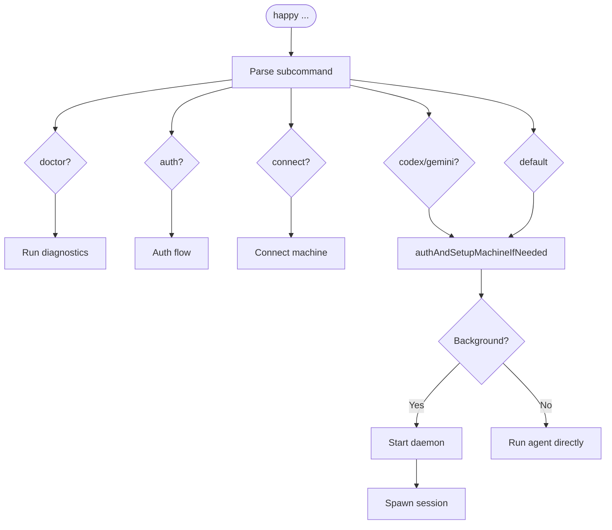

`src/index.ts` is the CLI router. It:
- Parses subcommands (`doctor`, `auth`, `connect`, `codex`, `gemini`, and default run flows).
- Ensures auth and machine setup when needed (`authAndSetupMachineIfNeeded`).
- Starts the daemon or runs an agent directly based on subcommand/context.

## Local state and configuration

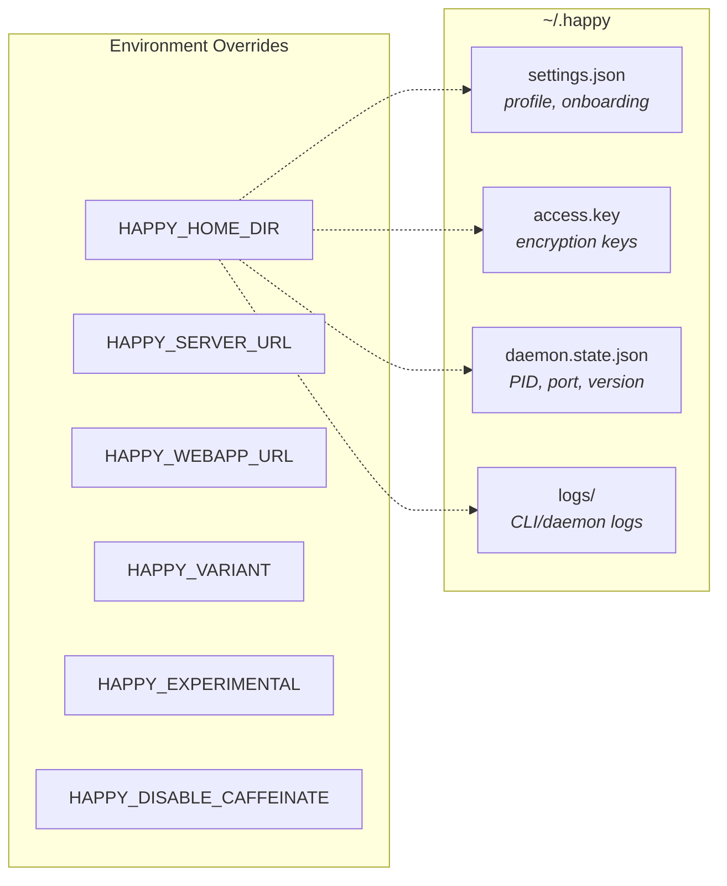

Local state lives under `~/.happy` (or `HAPPY_HOME_DIR`):
- `settings.json`: onboarding and profile settings (validated/migrated).
- `access.key`: local key material for encryption/auth.
- `daemon.state.json`: daemon PID + control port + version.
- `logs/`: CLI/daemon logs.

Configuration lives in `src/configuration.ts`:
- `HAPPY_SERVER_URL` and `HAPPY_WEBAPP_URL` override defaults.
- `HAPPY_VARIANT`, `HAPPY_EXPERIMENTAL`, `HAPPY_DISABLE_CAFFEINATE` control behavior.

## API client architecture

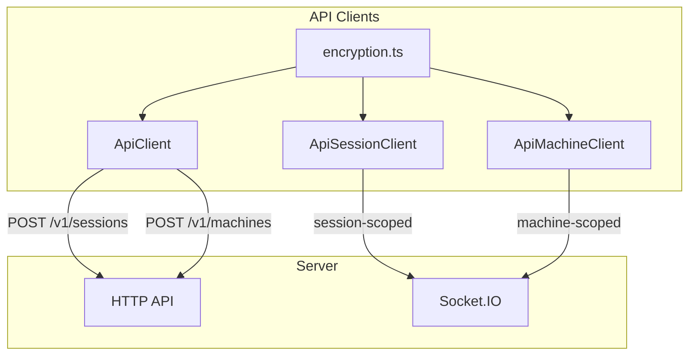

### HTTP
`ApiClient` (`src/api/api.ts`) handles:
- Session creation (`POST /v1/sessions`) with encrypted metadata/state.
- Machine registration (`POST /v1/machines`) with encrypted metadata/daemon state.
- Other CRUD actions through `ApiSessionClient` and `ApiMachineClient`.

### WebSocket

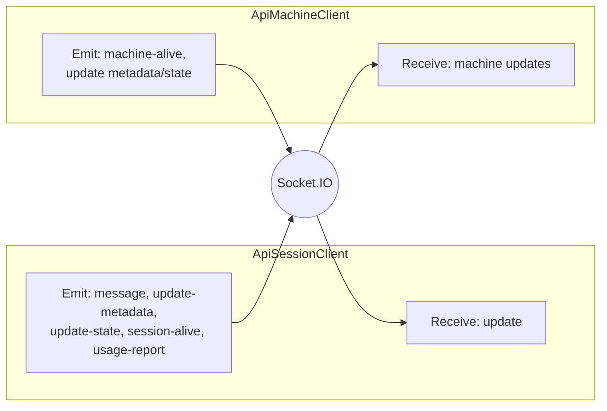

`ApiSessionClient` (`src/api/apiSession.ts`) connects to Socket.IO as a **session-scoped** client:
- Receives `update` events and decrypts message content.
- Emits `message`, `update-metadata`, `update-state`, `session-alive`, and `usage-report`.

`ApiMachineClient` (`src/api/apiMachine.ts`) connects as a **machine-scoped** client:
- Sends `machine-alive` heartbeats.
- Updates machine metadata/daemon state with optimistic concurrency.
- Receives machine updates and merges them locally.

### Encryption

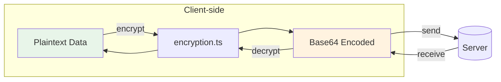

The CLI encrypts client content before it leaves the machine using `src/api/encryption.ts`.
- Session metadata, agent state, messages, machine state, artifacts, and KV values are encrypted client-side.
- On-wire encoding is base64; see `encryption.md`.

## Daemon architecture

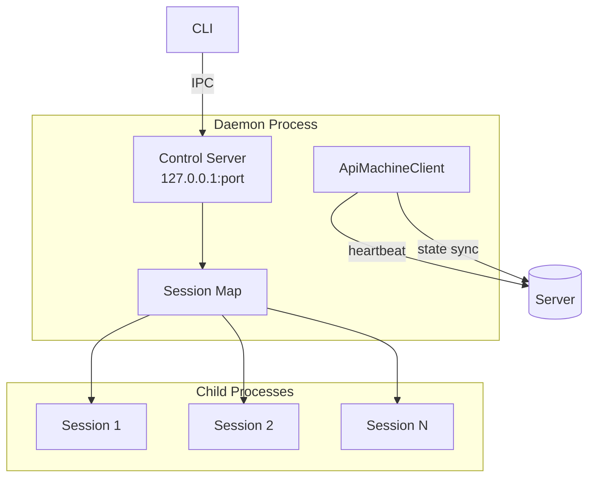

The daemon is a long-lived process responsible for running sessions in the background and maintaining machine presence.

### Lifecycle

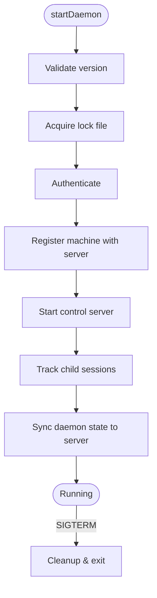

1. `startDaemon()` validates the running version and acquires a lock file.
2. It authenticates and registers the machine with the server.
3. It starts a local **control server** for IPC.
4. It keeps a map of tracked child sessions and updates daemon state on the server.

### Control server (local IPC)

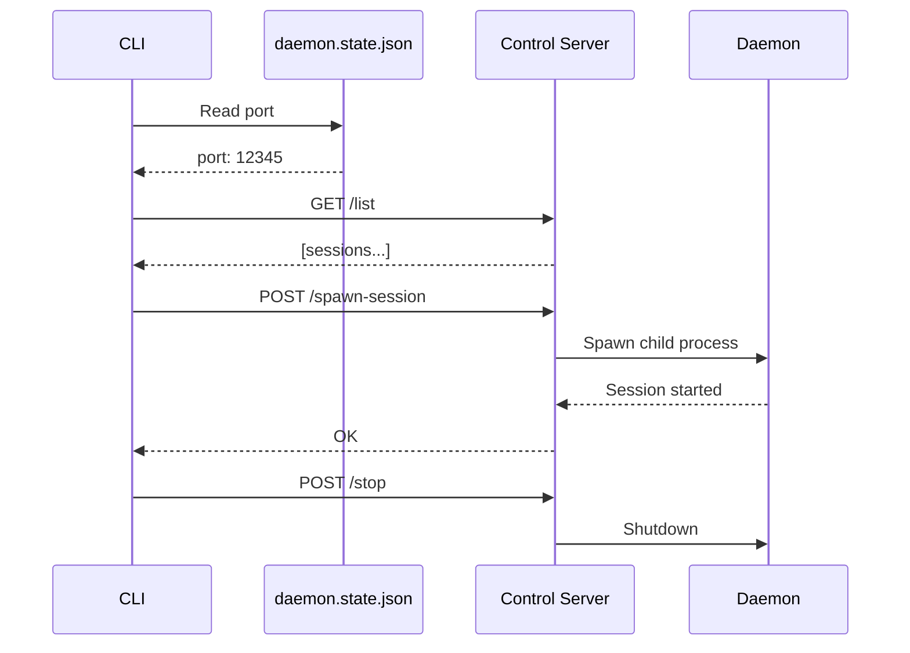

`startDaemonControlServer()` (`src/daemon/controlServer.ts`) runs an HTTP server on `127.0.0.1` and exposes:
- `/list` (list active sessions)
- `/stop-session`
- `/spawn-session`
- `/stop` (shutdown daemon)
- `/session-started` (session self-report)

The CLI talks to this server via `controlClient.ts`, using a port stored in `daemon.state.json`.

### Session spawning

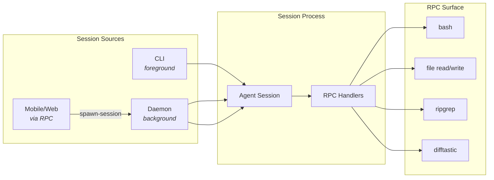

Sessions can be started by:
- The CLI directly (foreground).
- The daemon (background).
- Remote requests over RPC (from mobile/web via machine connection).

Daemon session spawning uses `registerCommonHandlers` to expose a controlled RPC surface (shell commands, file operations, search/diff helpers).

### Machine state

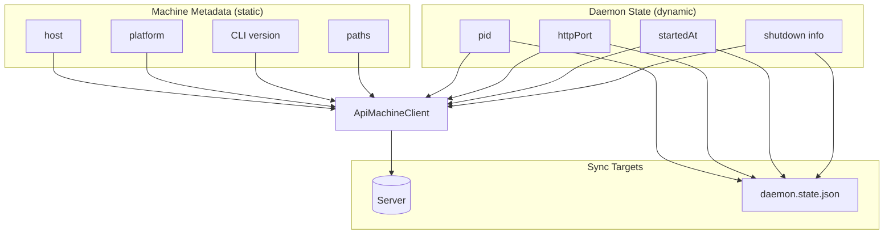

- **Machine metadata** is static info (host, platform, CLI version, paths).
- **Daemon state** is dynamic (pid, httpPort, startedAt, shutdown info).

The daemon updates these via `ApiMachineClient` and mirrors local state into `daemon.state.json` for control/diagnostics.

## RPC and tool bridge

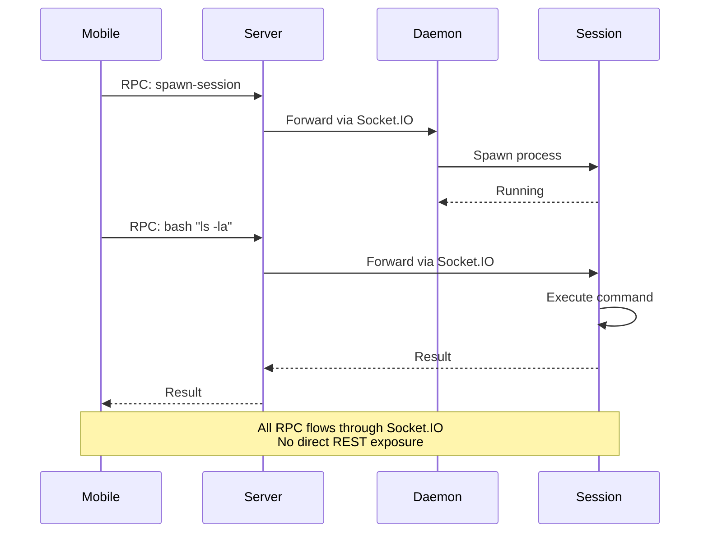

RPC is used to send commands over the Socket.IO connection:
- Sessions register RPC handlers (e.g., `bash`, file read/write, `ripgrep`, `difftastic`).
- The daemon registers a spawn-session handler so the server/mobile client can ask it to start a local session.

This mechanism allows the server and mobile clients to drive local actions without exposing a broad REST surface.

## Implementation references
- CLI entry: `packages/happy-cli/src/index.ts`
- Daemon: `packages/happy-cli/src/daemon`
- Control server/client: `packages/happy-cli/src/daemon/controlServer.ts`, `packages/happy-cli/src/daemon/controlClient.ts`
- API clients: `packages/happy-cli/src/api`
- Persistence: `packages/happy-cli/src/persistence.ts`
- Config: `packages/happy-cli/src/configuration.ts`

## Worktree dependency pressure reclaim

The authenticated machine RPC `worktree-dependencies:reclaim` accepts `{ path }` within
that daemon's allowed workspace root. Its process-wide queue coalesces canonical
primary-repository requests and serializes deletion across repositories, including
reconnected machine clients. `src/daemon/worktreeDependencyReclaim.ts` owns the filesystem
safety checks; `worktreeDependencyReclaimRpc.ts` owns request validation and scheduling.

Storage below `min(10%, 40GiB)` triggers reclaim, stopping at `min(15%, 60GiB)`.
Only registered `.aplus/worktrees` descendants' ignored `node_modules` are eligible.
Oldest-first execution handles >=7 day idle dependencies before the >=24 hour fallback.
Lock, cwd, symlink, registration, idle activity, nearest Git-root ignore and force-tracked
file checks are repeated immediately before deletion. Failed process inventory stops
reclaim; normal-capacity calls do not enumerate Git or scan processes/directories.
Source, branches and local edits are retained. The response separates diagnostic `du`
bytes from before/after physical free space because APFS clones and pnpm hardlinks do
not release independent blocks. This RPC is available from candidate .206 only after
publication; Desktop scheduling is a separate consumer rollout. It does not install a
background timer by itself. Revisit ownership if another privileged service takes over
machine filesystem lifecycle; revert by removing the consumer calls before removing RPC.


## Organization-shared difficulty routing

`difficultyRoutingRuntime.ts` owns automatic Claude/Codex turn selection after a
client supplies the versioned intent and a signed APlus user authorization. It
validates the turn through the APlus API, applies P1, conditionally sends encrypted
raw text for P2, and applies sticky/escalation policy within the allowed model
snapshot. Manual selections and legacy messages retain their existing behavior.
Selection state and the `difficulty-routing` session event are recorded after
queue acceptance; client metadata is not an authoritative execution result.

The daemon advertises its ephemeral host public key and polls the APlus host
election endpoint. Only the elected, enabled shared machine prepares the pinned
artifacts. `daemon/difficultyRoutingClassifierHost.ts` owns one worker, one native
job, a bounded queue, revocation checks before decryption/dequeue, and process
termination. A caller timeout never frees an active native slot. The worker starts
before provider initialization with a minimal environment and receives no user or
organization credential. Its process lifetime bounds native memory retention.
The fixed fp32 model has measured worker RSS around 3.24 GiB on macOS arm64; this
is not the size of the daemon or a cross-platform memory guarantee.

Client authorization and runtime routing budgets are 250ms and 750ms respectively,
with no classification retry. Failure preserves a validated P1 or legacy fallback,
not a forged shared-classifier success. Explicit empty/malformed raw prompt
overrides skip classification rather than falling back to wrapped system text.
The APlus API origin is separate from the Happy relay origin. Revisit first-party
worker ownership when a versioned headless Extension capability exists. Release
artifact installation and model quality acceptance remain deployment gates; the
feature defaults to OFF and this implementation does not change a release pin.

The shared worker's `difficultyRoutingDecision.ts` validates both binary scores
and applies the empirically selected hard threshold 0.1, tagged
`binary-recall-v2-t010` after the artifact hash. Scores are not calibrated task
probabilities. Shared P1 no longer treats bare Japanese/Chinese explanation
requests as confidently trivial; Desktop's legacy OFF policy is unchanged.
Independent synthetic evaluation found a small routing recall improvement, not
95% P2 acceptance. Revisit the threshold only with separate development data and
a fresh frozen evaluation; do not retune against the recorded test.

`difficultyRoutingPolicy.ts` snapshots Desktop's `USER_REQUEST_MODELS`. Since
2026-09-30 routine runs `claude-sonnet-5-5/medium`, and codex routine, hard and
escalated all run `gpt-6.1-sol` at low/high/xhigh (Claude Code 2.1.284+, Codex
0.159+; both verified with a real turn). `KNOWN_ROUTE_TIERS` keeps every earlier
pair so floors stored under a previous table are still retained exactly. An
org policy substitution first takes the pair the substitute model ran as for
the routed tier, in this table or an earlier one, so an allowlist written
before a table change (claude-opus-5-5 without claude-sonnet-5-5) keeps routine
turns on opus-5-5/low instead of raising them and the floor to hard. Only when
no such pair exists is the substitution model-only; if tiers share that model,
the highest non-escalated tier wins: escalated is a one-turn override, and Desktop's
`difficultyForModel` also reads the escalated model as hard. Revisit when
Desktop changes that reading, or when a shared catalog package replaces the
snapshot.

## Project lesson host

A session can be shown procedures verified in earlier work on the same
project, and can propose new ones for a person to approve. The code lives in
`packages/happy-cli/src/memory/`.

### Where authority comes from

Nothing in this CLI decides who a caller is. Three credentials already exist
and each answers a different question; the host uses them and adds one.

| Question | Answered by |
| --- | --- |
| Which account is this? | The account bearer (`Credentials.token`) |
| Does that account own this machine? | happy-server, when the machine socket connects |
| Does this session belong to this project? | The MCP caller-grant envelope, consumed at spawn |
| **Did a person just approve this lesson, and which directory may be opened for it?** | **The studio's lesson grant** |

The last one is new because the others cannot answer it. The caller grant binds
`{machineId, projectId, iat, exp}` and is spent when a session starts — it says
a session belongs to a project, never that somebody approved anything, and it
does not name a directory at all. A host that derived the workspace from the
spawn would let a valid grant for one project open another project's store.

So the studio signs `workspaceDir` off the authorized project row, along with
the operation and a digest of the exact request. `lessonGrantVerifier.ts`
checks it with the public half only: a compromised host can check a grant and
can never mint one.

### Bindings are handles, not data

CML calls a host-supplied `verifyBinding` at every entry and again before each
write. `lessonBindingIssuer.ts` is the only thing that can satisfy it: `issue`
returns an opaque handle and keeps the real binding in a `WeakMap`, so an
object merely *shaped* like a binding has no entry and is refused.

Freshness is re-read on every resolution — release, expiry, whether the runtime
closed, and the generation, which is the durable settings revision. That last
one is what makes a settings change anywhere on the machine stop work already
in flight.

### The two call paths

```
Desktop UI ──(signed grant)──► machine RPC 'lesson-host-v1'
                                   apiMachine.ts → lessonHostSupervisor
                                       → lessonHostRuntime → CML

provider process (runCodex / claudeRemote)
    createLazyLessonSessionHost  → its own supervisor, same signed-grant rule
        recall  → before the turn's input is assembled
        ack     → only once the provider accepted that input
        review  → after a turn ends normally
```

The daemon and the provider are different processes, so the provider builds its
own supervisor rather than reaching into the daemon's. It is allowed to because
everything it uses is already trusted there: the project id comes from
`HAPPY_CHECKPOINT_SPAWN_CONTEXT`, which the daemon writes and strips from
caller-supplied environment, and the workspace still comes from a signature.

Both share one state root. The daemon passes `HAPPY_LESSON_DAEMON_HOME`, and a
session on a different root reports the host unsupported — its settings file
and spending ledger would otherwise be a second, private copy.

### Selected is not delivered

`recall` produces a `selected` trace. The acknowledgement is sent only once the
provider has taken the input: for Codex that is `sendTurnAndWait` resolving
without an abort, for Claude the first assistant event of that turn. Pushing a
message onto the SDK queue is not acceptance, and acknowledging there would
record a delivery an abort could still have prevented.

The whole set of selected lessons is injected or none of it is. CML matches the
acknowledged list against its own trace exactly, so delivering a prefix while
acknowledging the full set would record a delivery that did not happen.

### Spending

The review worker refuses before it costs anything unless all of: review is
enabled, a resolved gateway config and a settled price both exist, the ledger
can reserve, and this host actually observed what the turn did. Observations
come from the provider's own command and tool events — a numeric exit `0`
verifies a success, a numeric non-zero verifies a failure, and `null` or a
cancelled status verifies neither.

A candidate is never a lesson. The worker holds `lesson.review` and can only
move a proposal to `reviewed`; `lesson.manage`, which accepts one, is carried
solely by a grant minted for a person's click.

### One injector per launch

CML's own hooks inject lessons too. They stand down when a launch carries
`CLAUDE_MEMORY_LESSON_OWNER=host`, which `lessonOwnerMarker.ts` decides and the
daemon writes into one child's environment — never into user settings.

The decision is made once per provider launch and fixed for that process,
because the host boots lazily: a marker that tracked readiness would silence
the native hook halfway through a session, or let both inject across the
switch.

Claiming requires three things, and the third is the one worth stating:

1. an eligible launch (not managed, authoritative project, configured studio);
2. an installed CML that states `LESSON_HOST_CAPABILITIES = { version: 1,
   nativeLessonOwnerMarker: true }` — an older build injects regardless;
3. a host that could actually be opened for the project, proved by opening it.

Without 3 a marker set on the strength of 1 and 2 leaves a session with *no*
lessons whenever the host then fails to authenticate — worse than injecting
twice, and much harder to notice. Any failure leaves the native hook in charge.

The session host honours the same decision from the other side: launched
without the marker, it does not inject at all.

Point 3 is the daemon's own proof: it opens the project with the daemon's
credential. That says nothing about a child staged with another user's
`access.key`, which asks the studio as that user and can be refused — in a
session whose marker had already silenced the native hook. So a launch whose
caller token names a different account than the daemon's stays native and CML
keeps recalling as it always has. A re-issued token for the *same* account is
the same identity, and so is a relocated `HAPPY_HOME_DIR`: the home moves, the
account does not.

Both the fresh spawn and the resume go through `lessonLaunchEnvironment.ts`,
and they have to. A resume rebuilds its environment and then runs the same
caller sanitizer, which strips every `HAPPY_LESSON_`/`CLAUDE_MEMORY_` key so a
caller cannot forge one — the daemon's own state root and marker included.
Re-establishing them after that strip is what keeps a resumed session's host
alive, and writing the marker explicitly (`native` as well as `host`) is what
stops one inherited from the daemon's environment deciding for it.

The lazy bootstrap is deliberately unbudgeted. `createLessonSessionHost` gives
up at a deadline for a caller that needs an answer before it can continue;
wrapping that in the lazy path would mean one slow studio call left a whole
session without lessons for good. Nothing waits on it, so a host that arrives
late simply serves the next turn, and `close()` never waits on a bootstrap
that may be stuck on the same studio it is shutting down because of.

### What is not wired

- **Managed runtimes have no lesson host.** They hold no account credential.
  The run credential they do hold is a happy-server session-scoped token, and
  the studio has no verifier for it — so "I am run X" and "run X acts for user
  Y" cannot be joined. Accepting a run id from an account bearer instead would
  let any account inherit any run's actor. The operations runbook states the
  two ways to close it.

Operator-facing configuration, rollout and rollback live in the studio
repository (`aplus-dev-studio`) under `docs/runbooks/lesson-host-operations.md`.

## Checkpoint history comparison and retention

The daemon owns the shared checkpoint Git store and binding lifecycle.
`checkpointFileDiff` serves bounded, read-only current-to-record comparisons after the
restore planner validates binding ownership, historical coverage and current exclusions.
It rejects unsafe paths and returns explicit binary/size outcomes; file lifecycle metadata
keeps empty-file creation and deletion visible without sending temporary machine paths.

`checkpointAgentReader` captures the launcher session/project/worktree binding and
canonical project path, rechecks current persisted availability per call, and delegates
to existing read RPC ownership/coverage/exclusion validation. `checkpointAgentTools`
registers only status/list/preview/diff on the session Happy MCP with strict inputs,
read-only annotations and the existing host admission/drain boundary. Responses are
paginated (50 records/100 files) or truncated (500 lines/64KiB UTF-8 diff); errors never
return raw store paths. Provider query/thread setup includes short guidance only while
history is enabled. Claude follow-ups within one live SDK query retain its initial
guidance, so tool status/call checks remain authoritative. Neither snapshot creation
nor restore execution is exposed; Desktop confirmation still owns restoration. Revisit
this read-only boundary only with a separately reviewed mutation/confirmation contract.

`checkpointRetention` applies 30-day/200-record retention per binding and a 5GiB soft
machine target through the store lock and garbage collector. It preserves latest baseline
and safety records, pins and uncertain/incomplete work; trusted absence of a managed
worktree starts a durable seven-day grace period. Unreadable binding metadata keeps that
binding's history while the idle pass continues for the others. The additive retirement
RPC resolves bindings from daemon metadata. A normal retirement only records absence under
the store lock; immediate deletion requires explicit confirmation, fails closed while any
binding metadata is unreadable, and drops only that worktree's refs and sidecars, leaving
other limits and object packing to the next idle pass. The heartbeat schedule runs at
startup and daily only with no live session/terminal or automation activity, retries a
failed pass after an hour, and drains on shutdown/handoff. Capacity batches start only
within a 60s pass budget because record and restore writers wait a bounded time for the
same lock; the idle pass also removes private diff operands older than an hour. Deleted
intermediate records write a durable provenance boundary before refs disappear so older
restores require explicit file inclusion. Revisit the conservative idle rule if long-lived
sessions prevent cleanup, and the capacity budget if a single packing run outlasts it and
storage pressure persists. Runtime release and Desktop pin adoption remain separate from
these source changes.

Checkpoint pin creation acquires the non-reentrant store lock and releases it before
running the restore action. `withManagedProducerLock` holds that same lock throughout
its callback, so `prepareManagedVolume` must not directly use the ordinary
`CheckpointRestoreExecutor` for that store: pin and snapshot operations would reacquire
it. The current production boot path initializes only an empty volume with no checkpoint
and an unwired restore port. Before wiring checkpoint boot restore, provide and verify an
adapter that honors the already-held lock; do not weaken GC pin ownership to allow nesting.

## AI credential group custody

The optional `ai-credential:group-sync` customer-lane RPC leaves the existing apply DTO and response unchanged. The daemon serializes group changes with legacy operations. An owner-only journal stores identity hashes, desired unions, generations and durable pending intent before provider writes. Revocation removes only introduced accounts no other assignment needs; legacy/manual apply invalidates the receipt and relinquishes touched slots. Provider adapters keep personal login and index selections. Completed receipts are readable through `ai-credential:status` and contain no credentials; server-lane mutation permissions are unchanged. A failed removal remains pending in the journal until an observed retry completes.
