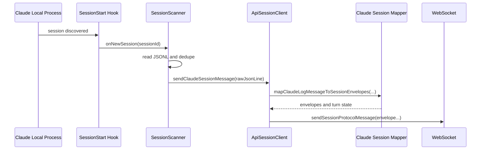
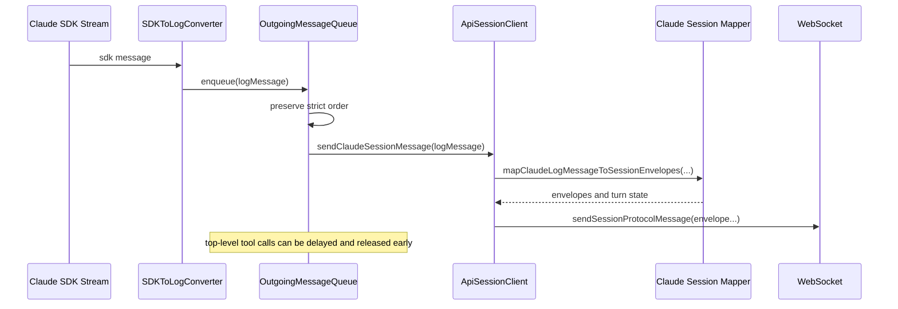
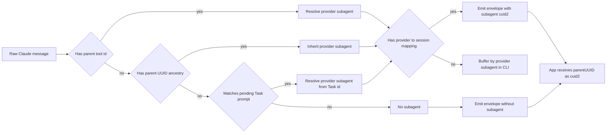
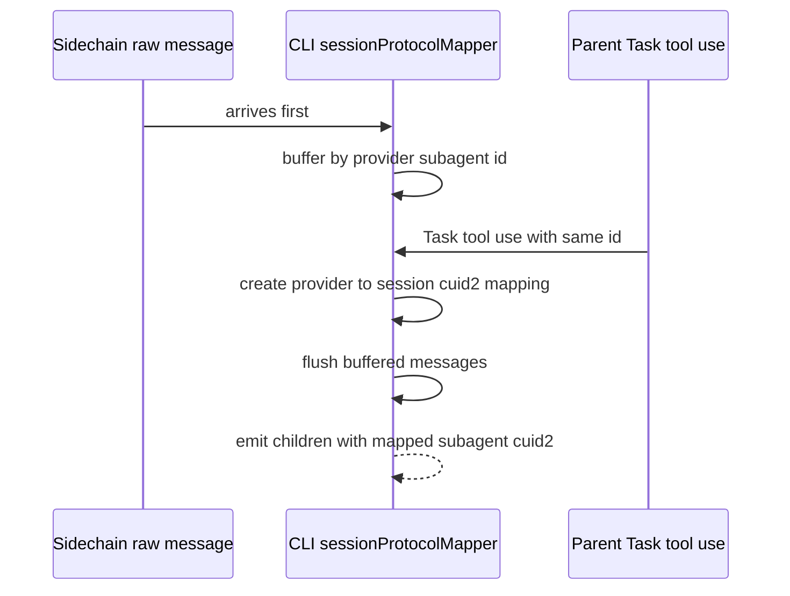
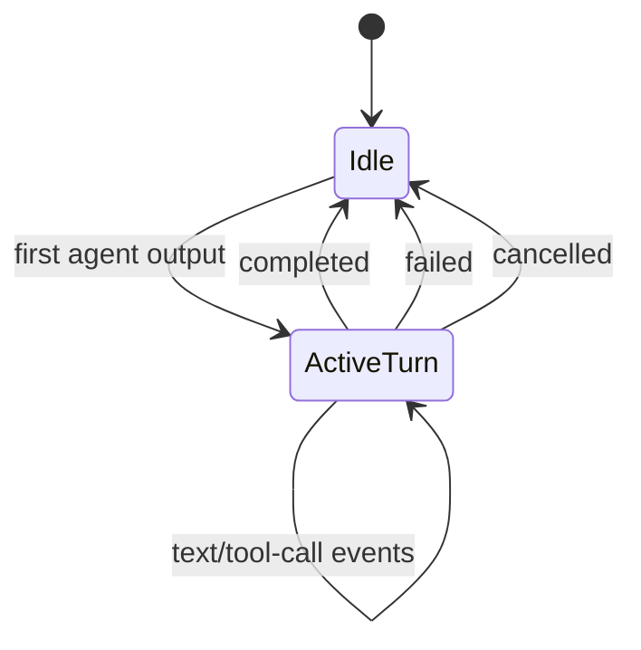

# Claude Session Protocol (Local + Remote)

This document explains how Claude launcher paths emit the unified session protocol (`content.type = "session"`), and how duplicate messages are avoided across session changes/restarts.

## Scope

- Local launcher path: `claudeLocalLauncher` + `sessionScanner` (file-based JSONL ingestion)
- Remote launcher path: `claudeRemoteLauncher` + SDK stream + `OutgoingMessageQueue`
- Shared protocol sender: `ApiSessionClient.sendClaudeSessionMessage()`

## Key Components

- `packages/happy-cli/src/api/apiSession.ts`
  - `sendClaudeSessionMessage(...)` maps Claude records into session envelopes and sends them.
  - `closeClaudeSessionTurn(status)` emits `turn-end` with `completed|failed|cancelled`.
- `packages/happy-cli/src/claude/utils/sessionProtocolMapper.ts`
  - Claude RawJSONLines -> session-protocol envelopes.
  - Maintains `currentTurnId` state.
- `packages/happy-cli/src/claude/utils/sessionScanner.ts`
  - Local-mode file scanner with message de-duplication.
- `packages/happy-cli/src/claude/utils/OutgoingMessageQueue.ts`
  - Remote-mode ordered outgoing queue.

## Local Launcher Flow

### Sequence



### Local turn-close behavior

- Abort/switch: `turn-end(status="cancelled")`
- Normal process exit: `turn-end(status="completed")`
- Non-zero launcher exit/error: `turn-end(status="failed")`

Implemented in:
- `packages/happy-cli/src/claude/claudeLocalLauncher.ts`

## Remote Launcher Flow

### Sequence



### Remote turn-close behavior

- On remote `onReady`: `turn-end(status="completed")`
- On abort: `turn-end(status="cancelled")`
- On launcher error: `turn-end(status="failed")`

Implemented in:
- `packages/happy-cli/src/claude/claudeRemoteLauncher.ts`

## Mapping Rules (Claude -> Session Protocol)

| Claude raw message | Session envelopes |
|---|---|
| `assistant` text block | `agent:text` |
| `assistant` thinking block | `agent:text` with `thinking: true` |
| `assistant` tool_use block (non-Task) | `agent:tool-call-start` |
| `assistant` tool_use block (`Task`) | no parent tool-call envelope; registers provider->session subagent mapping and flushes buffered subagent messages |
| `user` tool_result block (non-Task) | `agent:tool-call-end` |
| `user` tool_result block (`Task` parent result) | `agent:stop` for the subagent (no parent `tool-call-end`) |
| `user` plain string (non-sidechain) | `turn-end(completed)` (if open), then emit both `user:text` (legacy) and `session:text` (migration shadow copy) |
| `user` plain string (sidechain) | `agent:start` (once) then `agent:text` (`subagent` set to session cuid2) |
| `system` | ignored for protocol output |
| `summary` | ignored for protocol output (metadata update only) |

Notes:
- Turn starts lazily on first agent output in a turn (`turn-start` envelope created when needed).
- `turn` values in emitted protocol envelopes are cuid2 (examples below use `tA` shorthand for readability).
- Sidechain linking uses `subagent` on envelopes, and `subagent` is always a session cuid2.
- Mapper tracks `providerSubagentToSessionSubagent` so provider tool ids (Claude `toolu_*`) never leak into protocol envelopes.
- If `parent_tool_use_id` is missing (common in local/non-SDK logs), mapper infers provider subagent id from:
  1. `parentUuid` ancestry (`uuid -> providerSubagent` propagation), or
  2. `Task` tool prompt matching (sidechain root prompt to pending Task tool id).

## Concrete Examples

### Example 1: Remote normal turn (no sidechain)

Input SDK messages:

```json
{ "type": "assistant", "message": { "role": "assistant", "content": [ { "type": "text", "text": "I will inspect auth files." } ] } }
{ "type": "assistant", "message": { "role": "assistant", "content": [ { "type": "tool_use", "id": "toolu_1", "name": "Bash", "input": { "command": "rg auth src" } } ] } }
{ "type": "user", "message": { "role": "user", "content": [ { "type": "tool_result", "tool_use_id": "toolu_1", "content": "src/auth/index.ts" } ] } }
```

Emitted session envelopes (simplified):

```json
{ "role": "agent", "turn": "tA", "ev": { "t": "turn-start" } }
{ "role": "agent", "turn": "tA", "ev": { "t": "text", "text": "I will inspect auth files." } }
{ "role": "agent", "turn": "tA", "ev": { "t": "tool-call-start", "call": "toolu_1", "name": "Bash", "title": "Bash call", "description": "Bash call", "args": { "command": "rg auth src" } } }
{ "role": "agent", "turn": "tA", "ev": { "t": "tool-call-end", "call": "toolu_1" } }
{ "role": "agent", "turn": "tA", "ev": { "t": "turn-end", "status": "completed" } }
```

### Example 2: Sidechain message uses `subagent`

Input SDK message (from Task child context):

```json
{
  "type": "assistant",
  "parent_tool_use_id": "toolu_task_1",
  "message": {
    "role": "assistant",
    "content": [ { "type": "text", "text": "Subagent: found 3 files." } ]
  }
}
```

Session envelope:

```json
{
  "role": "agent",
  "turn": "tA",
  "subagent": "d6a2s8ydz2lh6ry5od3r2n6n",
  "ev": { "t": "text", "text": "Subagent: found 3 files." }
}
```

Where `d6a2s8ydz2lh6ry5od3r2n6n` is an adapter-generated cuid2 mapped from provider id `toolu_task_1`.

App normalization result (conceptual):

```json
{
  "role": "agent",
  "isSidechain": true,
  "content": [ { "type": "text", "text": "Subagent: found 3 files.", "parentUUID": "d6a2s8ydz2lh6ry5od3r2n6n" } ]
}
```

### Example 3: Orphan sidechain child arrives before parent tool call

Arrival order:

1. Child raw Claude message first:

```json
{ "type": "assistant", "parent_tool_use_id": "toolu_late", "message": { "role": "assistant", "content": [ { "type": "text", "text": "child before parent" } ] } }
```

2. Parent `Task` tool-use arrives later:

```json
{ "type": "assistant", "message": { "role": "assistant", "content": [ { "type": "tool_use", "id": "toolu_late", "name": "Task", "input": { "prompt": "Inspect auth flow" } } ] } }
```

CLI mapper behavior:

- Buffers the first message in `bufferedSubagentMessages["toolu_late"]` (keyed by provider subagent id; no envelope emitted yet).
- When `Task` `tool_use.id = "toolu_late"` is observed, mapper creates/uses `providerSubagentToSessionSubagent["toolu_late"] = "<cuid2>"`.
- Mapper immediately replays buffered entries and emits envelopes with `subagent = <cuid2>`.
- No parent `tool-call-start` envelope is emitted for `Task`.

### Example 4: Local restart dedupe (same JSONL line not resent)

Session file contains (already processed before restart):

```json
{ "type": "assistant", "uuid": "a-100", "message": { "role": "assistant", "content": [ { "type": "text", "text": "existing line" } ] } }
```

After restart, scanner loads existing file and seeds:

```text
processedMessageKeys += "a-100"
```

When the file is re-read and still contains `uuid = "a-100"`, scanner skips it and does not call `sendClaudeSessionMessage(...)` again.

### Example 5: Remote abort while sidechain tool is running

State before abort:

- Ongoing tool call map contains sidechain tool `toolu_sc_1` with `parentToolCallId = "toolu_task_1"`.

On abort/finalize:

1. Converter emits interrupted tool result with parent linkage:

```json
{
  "type": "user",
  "isSidechain": true,
  "parent_tool_use_id": "toolu_task_1",
  "message": { "role": "user", "content": [ { "type": "tool_result", "tool_use_id": "toolu_sc_1", "is_error": true, "content": "[Request interrupted by user for tool use]" } ] }
}
```

2. Mapper emits:

```json
{ "role": "agent", "turn": "tA", "subagent": "d6a2s8ydz2lh6ry5od3r2n6n", "ev": { "t": "tool-call-end", "call": "toolu_sc_1" } }
```

3. Launcher closes turn:

```json
{ "role": "agent", "turn": "tA", "ev": { "t": "turn-end", "status": "cancelled" } }
```

When the parent Task tool result is observed in the main turn, mapper emits:

```json
{ "role": "agent", "turn": "tA", "subagent": "d6a2s8ydz2lh6ry5od3r2n6n", "ev": { "t": "stop" } }
```

## Sidechain Deep Dive

Sidechain logic spans three layers:

1. Claude launcher output shaping (local scanner or remote SDK converter)
2. CLI session-protocol mapping (subagent resolution + orphan buffering)
3. App-side linking/tracing into Task children

### 1) How sidechain IDs are produced in CLI

#### Remote launcher

- SDK messages can include `parent_tool_use_id`.
- `SDKToLogConverter` preserves `parent_tool_use_id` and computes `parentUuid` chain for sidechain message lineage.
- For `Task` tool calls, remote launcher inserts a synthetic sidechain root via `convertSidechainUserMessage(toolUseId, prompt)` so the sidechain stream has an explicit root prompt.
- For interrupted tools on restart/abort, it generates sidechain-aware tool results with optional `parent_tool_use_id`.

Relevant files:
- `packages/happy-cli/src/claude/claudeRemoteLauncher.ts`
- `packages/happy-cli/src/claude/utils/sdkToLogConverter.ts`

#### Local launcher

- Sidechain semantics come from JSONL files read by `sessionScanner`.
- Scanner forwards unseen `RawJSONLines` records only.
- `sendClaudeSessionMessage()` applies the same mapper as remote.

Relevant files:
- `packages/happy-cli/src/claude/claudeLocalLauncher.ts`
- `packages/happy-cli/src/claude/utils/sessionScanner.ts`

### 2) How sidechains become session protocol (CLI-owned orphan handling)

`mapClaudeLogMessageToSessionEnvelopes()` extracts subagent linkage:

- Reads `parent_tool_use_id` (or camel variant) when provided
- Otherwise infers provider subagent via:
  - `parentUuid` -> previously known provider subagent id
  - sidechain root prompt -> pending `Task` tool call id
- Maps provider subagent id to session cuid2 via `providerSubagentToSessionSubagent`
- Emits agent envelopes with:
  - `turn = currentTurnId`
  - `subagent = mapped session cuid2`
- For `Task` parent tool calls:
  - does **not** emit `tool-call-start` / `tool-call-end`
  - emits only subagent stream lifecycle/content (`start`, `text`, `stop`) for that mapped subagent cuid2
- Tracks subagent ownership in CLI state:
  - `providerSubagentToSessionSubagent`: provider id -> session cuid2
  - `bufferedSubagentMessages`: raw sidechain messages waiting for provider subagent mapping
- If a sidechain message resolves provider subagent `X` but mapping for `X` does not exist yet:
  - message is buffered in CLI
  - nothing is emitted to server yet
- When a later `Task` `tool_use` has `id = X`:
  - mapper creates/looks up mapped session cuid2 for `X`
  - mapper flushes buffered messages for `X` in arrival order and emits envelopes with that cuid2

This is the main protocol-level sidechain key.



Relevant file:
- `packages/happy-cli/src/claude/utils/sessionProtocolMapper.ts`

### 3) How app links sidechain messages to Task tool calls

When `content.type = "session"` is normalized:

- `parentUUID = envelope.subagent ?? null`
- `isSidechain = (parentUUID !== null)`

Then reducer tracer resolves ownership:

1. Tool-call message indexed: `toolCallToMessageId[toolCallId] = parentMessageId`
2. Legacy sidechain message with `parentUUID = toolCallId` still maps directly via `toolCallToMessageId`
3. Session-protocol sidechain message uses `parentUUID = subagent cuid2`; app treats this as sidechain context identity, not provider tool id
4. Legacy prompt-based root matching (`sidechain` content + Task prompt) is still supported
5. App orphan buffering remains a fallback for legacy/history data, but source-of-truth orphan handling for new Claude session-protocol streams is CLI buffering.



Relevant files:
- `packages/happy-app/sources/sync/typesRaw.ts`
- `packages/happy-app/sources/sync/reducer/reducerTracer.ts`
- `packages/happy-app/sources/sync/reducer/reducer.spec.ts` (subagent-sidechain tests)

## Duplicate Handling and Restarts

### Local launcher: robust dedupe from scanner state

`sessionScanner` prevents duplicates by design:

1. On startup with existing `sessionId`, it marks all existing messages as processed before watching.
2. It de-duplicates globally with `processedMessageKeys`:
   - `user`/`assistant`/`system`: key = `uuid`
   - `summary`: key = `summary:<leafUuid>:<summary>`
3. On session changes (`onNewSession`), it:
   - skips same/already-pending/already-finished session IDs,
   - keeps watching old sessions too (Claude can still append there),
   - processes all watched sessions but only sends unseen keys.

This avoids replay duplicates during resume/fork/restart scenarios where files overlap.

Sidechain-specific effect:
- Sidechain records are deduped by the same scanner keys (`uuid`-based for user/assistant/system).
- Re-reads from both old and new session files do not re-emit already processed sidechain entries.
- `onNewSession` guards prevent re-activating already-finished/already-pending sessions.

### Remote launcher: ordered streaming, not file replay

Remote mode does not replay from disk. It streams SDK messages live:

1. `OutgoingMessageQueue` preserves strict send order by incremental queue id.
2. Delayed top-level tool-call messages are released when needed (permission request/tool result) to avoid out-of-order artifacts.
3. On each launcher cycle finalization:
   - outstanding tool calls receive synthetic interrupted tool results,
   - queue is flushed before continuing.
4. Parent-chain reset happens only when session ID actually changes (`previousSessionId` check), reducing restart-related churn.

Sidechain-specific effect:
- Top-level tool-call starts may be delayed briefly; sidechain tool-calls are sent immediately (no top-level delay path).
- On launcher finalization, interrupted sidechain tool calls get synthetic tool_result events, then queue flush ensures delivery order.

### Turn-state safety across restarts

- `ApiSessionClient` keeps Claude protocol turn state (`currentTurnId`).
- `ApiSessionClient` also preserves mapper sidechain state (`providerSubagentToSessionSubagent`, `bufferedSubagentMessages`, prompt/uuid linkage maps) during a launcher cycle.
- Launchers explicitly close turns on completion/abort/failure via `closeClaudeSessionTurn(...)`.
- This prevents stale open turns when loops restart.
- App tracer still has orphan maps as defensive fallback, but CLI mapper is responsible for first-pass orphan resolution for new session-protocol traffic.

## Mermaid: Turn Lifecycle



## Operational Notes

- Summary messages are still used for metadata/title updates, but not emitted as session events.
- In local mode, scanner dedupe is the primary protection against duplicate delivery after restarts.
- In remote mode, correctness is based on ordered live delivery and controlled launcher lifecycle boundaries.
