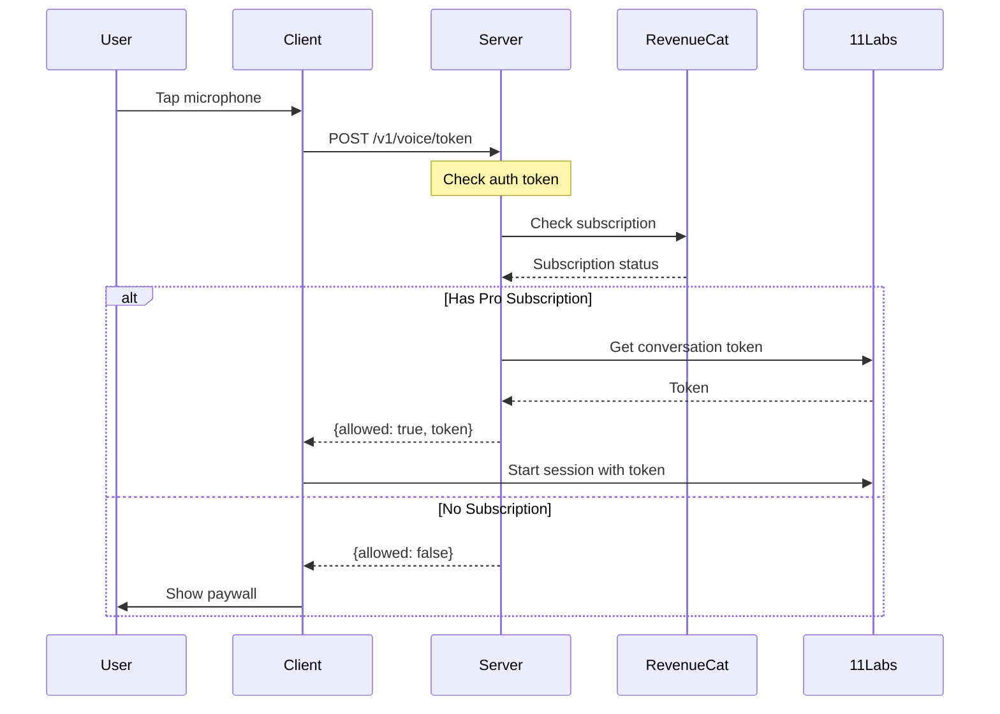

# 11Labs Voice Integration

## Critical Architecture Decisions

1. **Server validates RevenueCat** - Client sends public API key, server checks subscription
2. **Development bypasses paywall** - `ENV=dev` skips RevenueCat entirely
3. **Microphone permissions required first** - Blocks voice start until granted
4. **No client-side usage tracking** - 11Labs doesn't provide it

## Architecture

### Authentication Flow



### Implementation Details

#### Client-Side (`sources/sync/apiVoice.ts`)

```typescript
export async function validateAndStartVoiceSession(
    sessionId: string,
    initialContext?: string
): Promise<void> {
    const credentials = await TokenStorage.getCredentials();
    if (!credentials) {
        Modal.alert(t('common.error'), t('errors.authenticationFailed'));
        return;
    }
    
    try {
        // Server checks RevenueCat and returns token if allowed
        const response = await fetchVoiceToken(credentials, sessionId);
        
        if (response.allowed && response.token && response.agentId) {
            // Has subscription - start with token
            const voiceSession = getVoiceSession();
            await voiceSession.startSession({
                sessionId,
                initialContext,
                token: response.token,
                agentId: response.agentId
            });
        } else {
            // No subscription - show paywall
            const result = await sync.presentPaywall();
            if (result.purchased) {
                // Retry after purchase
                await validateAndStartVoiceSession(sessionId, initialContext);
            }
        }
    } catch (error) {
        console.error('Voice token fetch failed:', error);
        Modal.alert(t('common.error'), t('errors.connectionTimeout'));
    }
}
```

#### Server-Side (`sources/app/api/routes/voiceRoutes.ts`)

```typescript
app.post('/v1/voice/token', {
    preHandler: app.authenticate,
    schema: {
        body: z.object({
            agentId: z.string(),
            revenueCatPublicKey: z.string().optional()
        })
    }
}, async (request, reply) => {
    const userId = request.userId; // CUID from JWT
    const { agentId, revenueCatPublicKey } = request.body;

    const isDevelopment = process.env.NODE_ENV === 'development' || process.env.ENV === 'dev';

    // Production requires RevenueCat key
    if (!isDevelopment && !revenueCatPublicKey) {
        return reply.code(400).send({ 
            allowed: false,
            error: 'RevenueCat public key required'
        });
    }

    // Check subscription in production (skip in development)
    if (!isDevelopment) {
        const response = await fetch(
            `https://api.revenuecat.com/v1/subscribers/${userId}`,
            {
                method: 'GET',
                headers: {
                    'Authorization': `Bearer ${revenueCatPublicKey}`,
                    'Content-Type': 'application/json'
                }
            }
        );

        if (!response.ok) {
            return reply.send({ allowed: false, agentId });
        }

        const data = await response.json();
        const proEntitlement = data.subscriber?.entitlements?.active?.pro;
        
        if (!proEntitlement) {
            return reply.send({ allowed: false, agentId });
        }
    }

    // Get 11Labs conversation token
    const elevenLabsApiKey = process.env.ELEVENLABS_API_KEY;
    if (!elevenLabsApiKey) {
        return reply.code(400).send({ 
            allowed: false, 
            error: 'Missing 11Labs API key on the server' 
        });
    }

    const response = await fetch(
        `https://api.elevenlabs.io/v1/convai/conversation/token?agent_id=${agentId}`,
        {
            method: 'GET',
            headers: {
                'xi-api-key': elevenLabsApiKey,
                'Accept': 'application/json'
            }
        }
    );
    
    if (!response.ok) {
        return reply.code(400).send({ 
            allowed: false,
            error: `Failed to get 11Labs token`
        });
    }

    const data = await response.json();
    return reply.send({
        allowed: true,
        token: data.token,
        agentId
    });
});
```

## Microphone Permissions (CRITICAL)
- **MUST request permissions BEFORE starting voice** - otherwise first session fails
- **Web**: `navigator.mediaDevices.getUserMedia()`
- **iOS/Android**: `expo-audio` (SDK 52+, expo-av is DEPRECATED)
- Called in `handleMicrophonePress` before `startRealtimeSession`

## Configuration

### Client Environment Variables

```bash
# RevenueCat Public API Keys (already configured)
EXPO_PUBLIC_REVENUE_CAT_APPLE=appl_xxxxx
EXPO_PUBLIC_REVENUE_CAT_GOOGLE=goog_xxxxx  
EXPO_PUBLIC_REVENUE_CAT_STRIPE=pk_xxxxx

# Local Development (happy-cli)
HAPPY_SERVER_URL=http://localhost:3005
HAPPY_WEBAPP_URL=http://localhost:8081
```

### Server Environment Variables

```bash
# 11Labs API Key (required)
ELEVENLABS_API_KEY=your-elevenlabs-api-key

# Development environment flag
ENV=dev  # This skips RevenueCat checks in development
```

## Next Steps for Production

### Required Environment Variables
```bash
# Server (Production)
ELEVENLABS_API_KEY=xxx  # GET THIS FROM 11LABS DASHBOARD
ENV=production          # Enables RevenueCat checks

# Client (Already configured in production)
EXPO_PUBLIC_REVENUE_CAT_APPLE=appl_xxxxx
EXPO_PUBLIC_REVENUE_CAT_GOOGLE=goog_xxxxx
```

### Known Issues
- None currently

