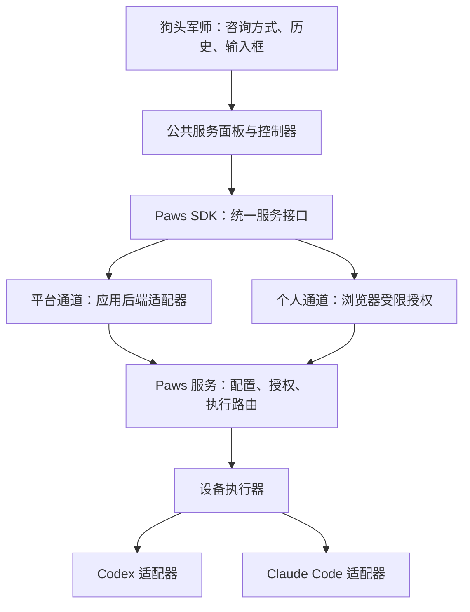

# Paws 公共 AI 服务设计：狗头军师首接

日期：2026-10-05。状态：用户已认可设计，进入实施计划阶段。未实现，未部署。

## 1. 目标和已确认约束

主要用户是机主自己。多个 AI 应用共用 Paws 基础设施。应用默认使用机主提供的服务，也允许用户连接自己的 Paws。

账号、设备、引擎、模型和推理强度由 Paws 管理。应用不保存模型账号认证，不自行启动 Codex 或 Claude。用户在授权范围内调整模型，不需要重新扫码。

首期只接入狗头军师。验证通过后再推广。不增加积分、套餐、用户调用配额或统一网站登录系统。保留已有鉴权、输入大小限制和资源保护，不将“无业务限额”解释为无限并发。

本设计中的“本地 AI”是设备上的执行器与登录环境。模型计算通常仍由上游服务完成。

## 2. 现状与证据边界

本次读取 Paws 源码基线为 `af831f55`。核对的狗头军师部署目录为 `session-restore-20261005-f0dbfff`，发布清单提交为 `f0dbfffea628506479810c9422489f664a0e78c3`。这些是本次观察基线，不代表未来实施时的最新版。

| 已有能力 | 当前缺口 |
| --- | --- |
| Codex 账号注册、设备默认绑定、会话授权、凭据刷新和额度快照 | 尚无应用共用的完整服务配置 |
| SDK 支持远程会话与浏览器授权对话 | 两条接入路径的调用方式和权限不同 |
| 狗头军师支持平台服务、我的 Paws、直接 API 连接 | 平台服务仍直接启动本机 Codex |
| 浏览器扫码、Paws 网页/手机确认、撤销授权 | 应用标识仍固定为狗头军师，授权绑定具体设备 |
| 授权对话支持 Codex 和 Claude | 引擎/模型列表有静态配置，该协议没有统一推理强度字段 |
| 平台服务保留服务端历史，个人授权链路加密保存消息 | 不能为统一接口而把两类历史或密钥合并 |

依据：Paws 的 `packages/paws-agent/src/delegation/browserDelegation.ts`、`packages/paws-agent/src/resources/sessions.ts`、`packages/happy-wire/src/appChat.ts`、`packages/happy-cli/src/daemon/appDelegation/`、`packages/happy-server/sources/app/api/routes/appDelegationRoutes.ts` 和 `docs/app-delegation.md`；狗头军师部署版本的 `server.mjs`、`agent.mjs`、`direct.mjs`、`public/chat.js`。

现有主账号登记了两个 Codex 账号。网站专用 Paws 身份下的执行器仍使用本地认证，未绑定中央账号。将网站全部接入 SDK，并不自动完成账号纳管。

## 3. 方案选择

| 方案 | 优点 | 代价 | 结论 |
| --- | --- | --- | --- |
| 各应用复制连接页和调用逻辑 | 单次接入快 | 协议、默认配置、错误处理持续分叉 | 不采用 |
| 公共 SDK、公共控制器、轻量界面组件 | 统一逻辑，保留业务界面和技术栈 | 首次需要明确协议和状态模型 | 采用 |
| 独立 AI 门户，所有应用跳转到门户聊天 | 管理集中 | 改变现有产品流程，业务上下文接入复杂 | 首期不采用 |

## 4. 总体结构



统一的是公共接口、配置语义和结果状态。平台通道和个人通道保留各自的信任边界。个人通道的解密密钥不经过应用后端。平台凭据不下发到浏览器。

平台通道由应用后端通过 SDK 连接 Paws。它使用只允许本应用和指定服务的服务端授权，不使用可操控整个 Paws 账号的根凭据。开发者在 Paws 中配置一次平台服务授权；网站使用者无需扫码。

## 5. 公共模块与交付位置

下列模块名为设计名称，未创建包，也不代表现有 API。

| 模块 | 责任 | 首期形式 |
| --- | --- | --- |
| Paws 服务核心 | 应用登记、服务配置、授权、执行解析、状态与记录 | 扩展现有 Paws Server 与 daemon |
| `paws-agent` 服务接口 | 服务发现、连接、会话、发送、停止、恢复、实际配置 | 扩展现有包，提供 browser/node 入口 |
| 无界面服务控制器 | 选择服务、授权状态、能力加载、配置校验、错误操作 | SDK 独立导出，不依赖 React 或 DOM |
| `paws-connect-ui` | 服务选择面板、连接流程、配置选择、状态详情 | 拟建轻量 DOM 组件，CSS 变量主题适配 |
| 应用适配器 | 平台后端桥接、应用登录校验、业务历史映射 | 狗头军师中保留薄适配层 |

SDK 和组件作为有版本的公共包发布。应用固定兼容版本，不再从某个本地 Paws checkout 临时打包授权源码。公共协议放在 `happy-wire`，避免 UI、服务端与执行器分别定义。

狗头军师使用原生 JavaScript，可直接挂载 DOM 组件。未来 React 应用通过 ref 包装同一组件和控制器，不复制逻辑。手机网页采用同一面板的底部弹层布局。Paws 原生手机端复用协议、字段与文案，不要求复用 DOM 渲染器。

首期不抽取完整聊天界面、咨询角色、Markdown 渲染或业务笔记系统。

## 6. 服务与配置模型

### 服务是稳定入口

应用引用 `serviceId`，不把账号、机器和具体模型写死。服务有所有者、显示名、启用状态、默认配置及修订号。

首期只建立必要的服务：机主提供的默认服务，以及用户授权连接的个人服务。每个应用默认跟随前者。管理员可为应用选择不同服务，不开发复杂自动路由规则。

### 执行配置

配置包含 `machineId`、`engine`、`accountRef`、`modelId`、`reasoning`。允许 `modelId` 或 `reasoning` 使用执行器默认值，但解析结果必须说明哪些字段已验证，哪些仅为默认或未知。

Codex 的 `accountRef` 使用已有中央账号对象。Claude 首期引用设备上的已验证登录身份或 API 配置；标记为设备范围，不假称已经实现可跨设备搬运的中央 Claude 账号库。不把账号认证写入服务配置。

选择优先级：允许的会话覆盖 → 应用选择的服务 → 该服务默认配置。应用业务提示词不能改变执行配置或扩大授权。

### 会话固定配置

创建新对话时，Paws 解析配置并形成 `ExecutionBinding`。它固定服务修订、设备、引擎、账号身份、请求模型、推理设置和权限。每轮保存请求配置与执行器上报的实际配置。

修改默认值只影响新对话。原对话继续使用原绑定。认证 token 更新仍跟随同一账号的最新凭据版本，不能固定旧 token。

要在原对话中换服务、账号或引擎，首期采用“使用新配置开启对话”。跨服务携带历史需要用户明确选择，不自动传递咨询内容。账号被删除、权限被撤销或模型不再可用时，原对话停止新调用，不回退到其他账号。

## 7. 模型与推理强度

能力目录由目标设备执行器提供。它报告引擎、可用模型、图片支持、可用推理设置、默认值、观察时间和协议版本。查询必须结合所选账号，因为不同账号的可用模型可能不同。

Codex 复用真实模型目录查询。Claude 适配器必须依据已验证的 CLI 能力提供目录；若只能取得有限别名，则标记为有限目录，不显示为完整实时列表。不支持明确推理档位时，只提供“默认”，不伪造与 Codex 等价的档位。

界面从目录生成选项，服务端和执行器在执行前再次校验。缓存目录标明观察时间；设备离线时不把缓存当作可执行证明。固定配置不可用时，返回明确错误，不静默替换。

首期不加入“快速/深入”的跨引擎自动映射。先确保用户选择的原生参数能准确生效，再评估简化档位。

## 8. 连接与授权

### 默认使用平台服务

保留狗头军师现有邮箱登录。登录后直接使用已配置的平台服务。应用后端校验自身用户与对话归属，再通过 SDK 请求 Paws。首期不增加跨站 SSO 或用户计费系统。

### 切换到我的 Paws

用户点击“连接我的 Paws”。同设备可跳转 Paws 授权页；跨设备可扫码，用网页或手机确认。二维码只是同一授权流程的入口，不是另一套账号机制。

授权页展示应用名称和来源、所选个人服务、允许的引擎与操作、有效期。默认配置预先填好，不要求再次逐项选择模型和强度。用户可以展开修改。

授权绑定应用、所有者、服务、批准的设备/账号/引擎范围和操作权限。初期批准当前设备与账号；更换到未经批准的设备、账号或引擎时补充授权。服务默认值的调整不能绕过该范围。

在批准范围内换模型或推理强度无需重新扫码。用户可以初次同时批准已经可用的 Codex 和 Claude；旧 `codex:chat` 授权不能自动升级。

### 连接保留与撤销

默认保留现有标签页会话存储。提供显式“在此浏览器记住连接”。记住后，受限凭据和消息密钥保存在该应用 origin 的 IndexedDB；说明同源脚本可访问，不称为不可窃取存储。SDK 不打印这些字段。

应用退出登录时锁定并清除本地连接材料；Paws 授权是否撤销由独立操作决定。对话密文不因忘记本地连接而自动删除。授权过期、撤销或浏览器数据被清除后，提示重新连接；不宣称永久授权等于永久保存浏览器密钥。

首期仍按应用分别授权。未来可增加明确列出的应用组，但不将新应用自动纳入旧授权。当前不实现全站共享令牌。

## 9. 公共交互

输入框附近只显示“AI 服务：平台提供”或“AI 服务：我的 Paws”，以及异常状态。点击打开公共服务面板。

```text
AI 服务
  ● 平台提供                 可用
  ○ 我的 Paws                连接

执行设置
  跟随服务默认配置
  [高级设置]                 可选

状态与详情
  实际引擎 / 模型 / 推理设置
  设备状态 / 账号状态 / 额度观察时间
```

面板统一处理：未连接、等待授权、可用、设备离线、登录失效、额度不足、授权撤销、版本不兼容。每个状态只提供相关操作，例如重新连接、打开 Paws 管理、刷新状态或使用另一服务开启新对话。

公共组件有状态枚举和事件；应用不解析错误文本决定行为。组件使用语义化按钮、键盘焦点、移动端布局与 CSS 变量。适配项目 Glass UI，不内置狗头军师配色或业务文案。

## 10. 统一调用契约

以下为语义契约，不是可运行代码。实施时沿用 SDK 现有命名风格。

| 操作 | 输入与结果 |
| --- | --- |
| `services.list` | 返回当前应用可见的服务及脱敏状态 |
| `capabilities.read` | 按服务/账号配置返回真实能力目录 |
| `connections.authorize` | 应用、服务、请求权限；返回受限连接 |
| `conversations.create` | 服务、应用会话标识、必要能力；返回固定执行绑定 |
| `turns.start` | 对话、幂等请求 ID、业务消息和附件 |
| `turns.observe` | 流式增量、状态、实际配置；支持游标恢复 |
| `turns.read` | 查询已接受请求的持久化结果 |
| `turns.cancel` | 停止指定回合，返回最终或待确认状态 |

Node 和浏览器入口统一这些操作的语义。平台使用应用后端桥接，个人服务保留浏览器加密传输。组件只依赖控制器，不接触根账号认证。

优先复用已有流和消息持久化。断线先读取同一回合，不重新发起模型调用。事件通道不可用时提供手动同步，首期不新增持续后台轮询。

统一错误码至少区分：授权失效、设备离线、账号需登录、模型不可用、参数不支持、额度不足、执行中断、协议不兼容。错误不能携带原始认证、主机路径或内部日志。

## 11. 管理入口

在 Paws 既有设置中增加“AI 服务”。保留既有账号、设备和已授权应用入口，以引用关系连接它们。

页面显示默认服务配置、引用它的应用、可用状态及最近调用。管理员可以修改配置，明确提示“仅影响新对话”。模型与参数从能力目录选择。

调用记录包含应用、对话/回合、配置修订、设备、账号引用、引擎、请求与实际模型、推理设置、时间和结果。中心记录只需元数据，不集中保存所有应用的聊天正文。

额度展示上游账号余额和观察时间。未提供的 Claude 额度显示“未知”。不将 token 估算冒充上游剩余额度，不实现用户积分或业务扣费。

## 12. 狗头军师迁移

1. 先交付公共协议、服务配置与两个引擎适配。建立真实平台服务，将所用 Codex 账号纳入中央管理。Claude 按设备登录引用接入。
2. 从现有授权流程提取通用应用登记、连接控制器与面板。应用登记包括 appId、名称、受信 origin 和执行能力；不能只把写死字符串改成任意客户端参数。
3. 为狗头军师添加 SDK 平台后端适配器。新对话经 Paws 执行，`agent.mjs` 不再承担新默认服务请求。
4. 用同一面板接入“我的 Paws”，保留加密、撤销、历史隔离与来源检查。
5. 保留邮箱登录、咨询方式、图片输入、停止、断线恢复、历史、删除和已有分享行为。
6. 迁移前等待正在运行的旧回合结束。旧历史继续可读。对旧平台对话的后续提问，首次续聊时建立 Paws 执行绑定并提交应用已有精选历史；优先保留已确认的原账号、引擎和模型，不套用新的全局默认。无法确认或复现原配置时，先让用户选择，再提交历史。显示一次“此对话后续由 Paws 执行”。记录迁移位置，幂等防止重复创建。
7. 旧个人授权保持原协议与权限。新增服务配置功能需要升级授权时，明确说明原因，不删除旧历史。
8. 既有直接 API 连接暂保留兼容，不新增此类连接。其历史和已保存连接继续可用，并标为未纳管路径；用户选用它时不能宣称已全部经 Paws。未来由独立 API 适配器接入 Paws 后再收敛，不在首期强制删除。

迁移使用应用级功能开关。回退只影响之后的新请求；已经交给 Paws 的回合仍通过 Paws 查询和停止，不能交给旧实现重跑。采用新增字段和表，保留原对话及连接标识。

首期完成的准确口径：狗头军师的默认服务与个人 Paws 服务统一接入；直接 API 为明确列出的兼容例外。

## 13. 首接验收与推广门槛

| Case | 必须验证的结果 |
| --- | --- |
| A1 默认服务 | 登录后直接提问；调用记录证明由 Paws 执行，应用不启动本地 Codex |
| A2 中央配置 | 在 Paws 换配置，新对话使用新值，旧对话维持原绑定 |
| A3 多账号 | 两个真实 Codex 账号分别执行可验证回合；记录对应账号且不串用 |
| A4 多引擎 | 真实 Codex 与 Claude 回合成功，实际模型可核对；未登录的引擎明确不可用 |
| A5 推理强度 | 支持的设置准确传入；不支持的设置拒绝；未知实际值不伪造 |
| A6 个人连接 | 桌面跳转和手机扫码均能授权；范围内调整不要求重复扫码 |
| A7 断线与取消 | 刷新、断线、停止、恢复结果均对应同一回合，不重复调用 |
| A8 故障边界 | 离线、失效、额度不足和撤销不静默更换账号或付费方 |
| A9 历史迁移 | 旧平台对话可续聊，个人历史不串源；直接 API 兼容例外明确可见 |
| A10 可复用性 | 第二个最小演示应用使用同一已构建包，只更换应用登记与业务输入，不复制授权或模型选择逻辑 |
| A11 交互 | 桌面与手机网页可用；焦点、错误操作、主题适配通过 Ego 实测 |
| A12 授权范围 | 应用授权不能调用全账号 API；问答不能获得终端/浏览器权限；来源与对话绑定有效 |

A1–A12 通过后，机主至少完成一次完整日常使用，并核对调用记录与历史恢复。缺少真实 Claude 环境时，A4 保持未通过，不能宣称双引擎已完成。

通过后先推广知学与缠论问答。MISS 采集和 Mac Ops 涉及不同工具能力，另行定义应用能力与执行适配；复用连接、配置、状态和管理模块，不直接套用无工具的问答执行器。

## 14. 实施与发布边界

本稿只定义设计。未创建公共包、修改 SDK、调整账号或更新线上服务。

审阅本稿后再制定分阶段实施计划。实现前核对各仓库当时主线、运行版本和指令；Paws 根目录保持干净，开发在独立 worktree 进行。发布顺序为向后兼容服务端 → 执行器 → Paws 管理/授权界面 → 公共 SDK 与组件 → 狗头军师试点。按能力版本开启新协议，旧客户端继续使用旧路径。

设计不授权自动推广其他网站。狗头军师验收通过后，展示真实结果和剩余兼容例外，再决定后续接入批次。
