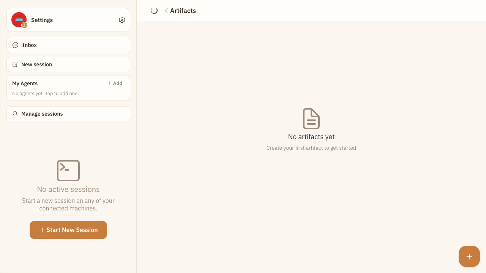
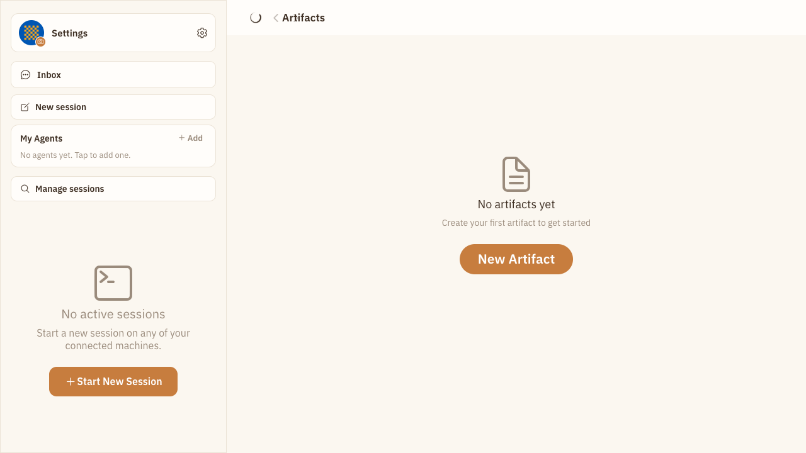

# Batch 22：工件空态新建入口

> 使用 PC Web 全站交互评审发现并修复工件空态的主操作发现性问题；评审、实现与修复后验收分阶段执行。

## 一、环境与范围

- 基线 commit：`0c564153fca85980ca1e394028a1e5b368d27c83`
- worktree：`../happy--pc-interaction-review-20260731`
- branch：`fix/pc-interaction-review-20260731`
- 评审主模式：全站交互 E2E 走查
- 验收主模式：回归验收
- 登录态：隔离 `authenticated-empty` 环境，不复用用户 Chrome
- 视口：`1024×768`、`1280×720`、`1440×900`、`1920×1080`
- 安全边界：只操作临时环境；环境销毁后无持久数据残留

## 二、初评覆盖

- 既有 Playwright 回归：52 个 Case，51 passed、1 skipped。
- 视觉覆盖：28 个用户向路由，加 5 个关键页面的四档桌面视口，共 48 个页面/视口项。
- 页面布局：未发现水平溢出；关键页面均可达。
- Browser Control：Chrome DevTools 与 in-app browser 在本会话均不可用，按项目既有 `web-e2e` Harness 降级；不得把本轮描述成 Browser Control 成功。
- 环境说明：默认 Playwright 配置因本机缺少配套 ffmpeg 无法创建页面；按既有经验使用 `video: off` 临时配置重跑，产品 Case 正常完成。

## 三、确认问题

### PC-003（P2）：工件空态的主操作与任务说明脱节

位置：`/artifacts` 空态。

复现：

1. 在任一桌面视口打开空工件列表。
2. 观察居中的空态标题和“创建第一个工件”说明。
3. 查找对应的新建入口。

实际结果：

- 空态内容附近没有可见操作。
- 唯一入口是远离空态的右下角纯图标 FAB。
- FAB 有 `New Artifact/新建工件` 可访问名称，真实点击可以进入 `/artifacts/new`，但没有可见文字、Tooltip 或 hover 反馈。
- 任务仍可完成，但桌面用户需要把空态说明与远端孤立 `+` 图标自行关联；视口越宽，两者距离越大。

PC 预期：

- 空态内容旁提供清晰、有文字的 `New Artifact/新建工件` CTA。
- 空态只保留一个主操作，避免 CTA 与 FAB 竞争。
- 列表非空时继续保留紧凑 FAB。
- CTA 可以通过鼠标和键盘激活，导航结果保持 `/artifacts/new`。

## 四、修复前截图

`1280×720`：空态说明位于主内容中心，唯一新建入口是右下角孤立 `+`。

## 五、修复

1. 空态内容内复用已有 `artifacts.new` 文案，加入可见 `RoundButton` CTA。
2. 空态不再渲染 FAB，避免两个同级新建入口竞争。
3. 工件列表非空时继续渲染原有 FAB，不改变熟悉的快速新建路径。
4. 新建导航收敛为同一个回调，CTA 与 FAB 都进入 `/artifacts/new`。
5. 正式 CRUD E2E 补充 CTA 可见文字、唯一性、键盘聚焦与 Enter 激活，以及非空态 FAB 保留断言。

## 六、修复后截图

`1280×720`：明确 CTA 与空态说明形成同一任务组，右下角不再出现竞争入口。

## 七、回归验收

结论：**通过，PC-003 已修复。**

| Case | 结果 | 证据 |
|---|---|---|
| 1024×768 空态 CTA | 已修复 | CTA 为 `180×48`，完整位于视口，和说明水平居中；Enter 导航成功 |
| 1280×720 空态 CTA | 已修复 | CTA 为 `180×48`，完整位于视口，和说明水平居中；Enter 导航成功 |
| 1440×900 空态 CTA | 已修复 | CTA 为 `180×48`，完整位于视口，和说明水平居中；Enter 导航成功 |
| 1920×1080 空态 CTA | 已修复 | CTA 为 `180×48`，完整位于视口，和说明水平居中；Enter 导航成功 |
| 非空工件列表 | 已修复 | 可见文字 CTA 消失，保留一个具名 FAB |
| 临时状态清理 | 已修复 | 临时工件通过 UI 删除，空态恢复 |

- 独立回归与正式 CRUD Case：2 passed。
- 四档 CTA 动作增量：Console error 0、失败 XHR/Fetch 0。
- `pnpm --filter happy-app typecheck`：passed。
- `git diff --check`：passed。
- 新增回归：0。
- 阻断或证据不足：0。

## 八、PR、CI 与合并

待 PR 合并后补充。
