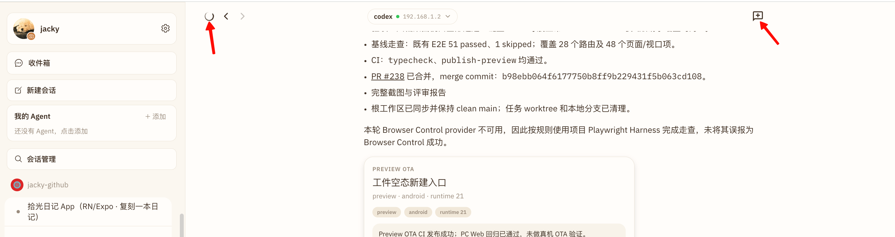
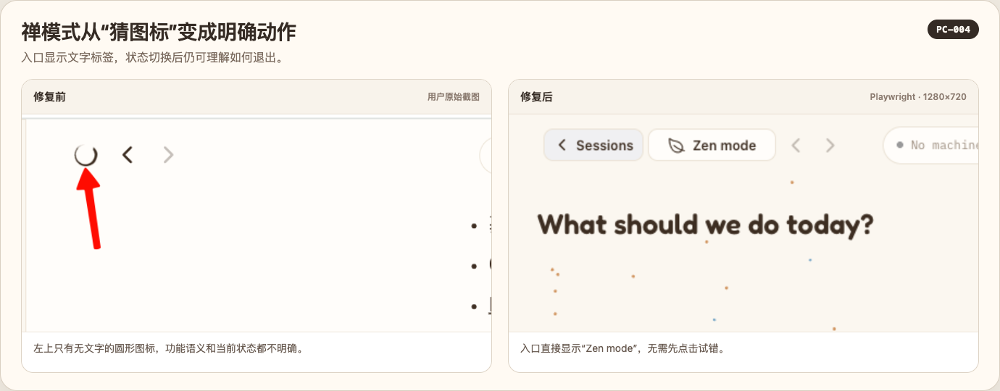
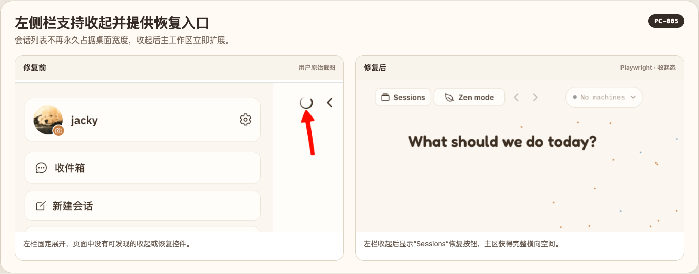
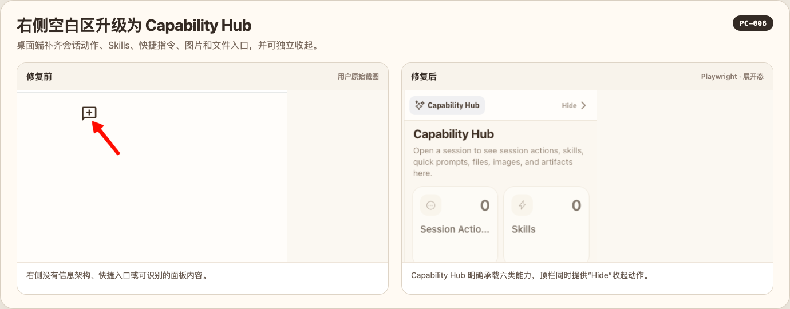
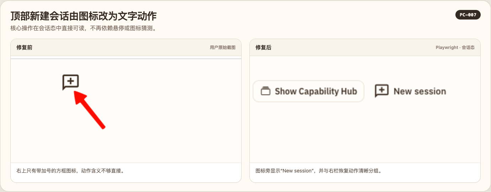
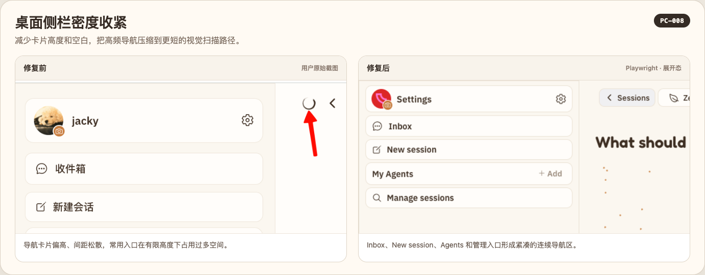
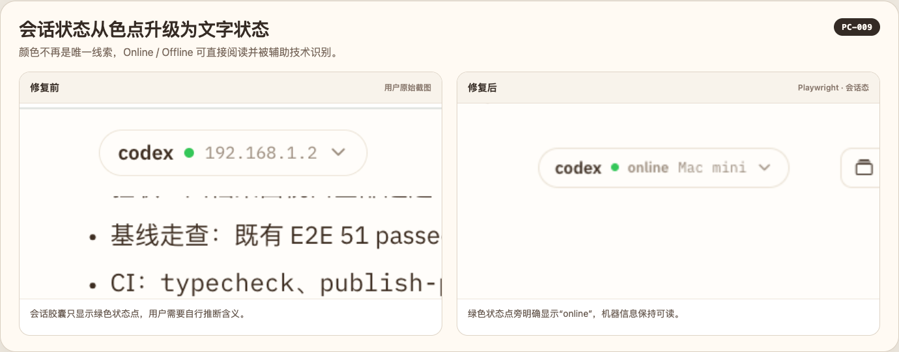
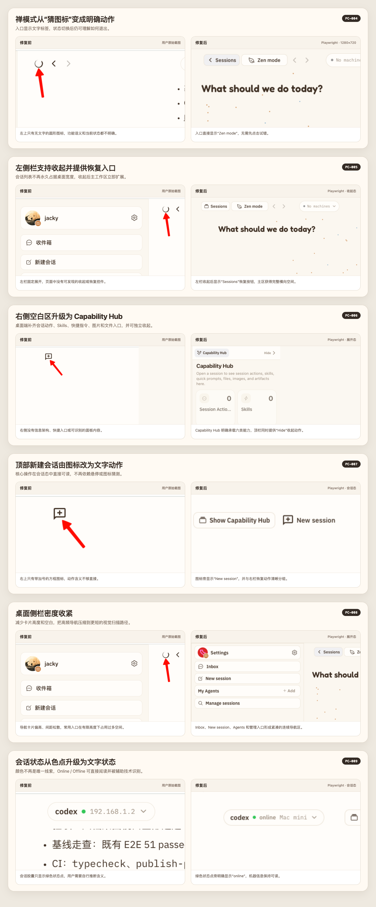

# Batch 23：PC 三栏工作区交互

> 根据 PC Web 二次走查与用户补充反馈，集中修复禅模式、左右栏、新会话入口、桌面密度和连接状态表达共 6 项问题；实现、代码复审与修复后验收由不同 Agent 执行。

## 一、环境与范围

- 基线 commit：`b98ebb064f6177750b8ff9b229431f5b063cd108`
- worktree：`../happy--fix-pc-workspace-panels`
- branch：`fix-pc-workspace-panels`
- 评审主模式：PC Web 回归验收
- 登录态：项目 Playwright Harness 创建的隔离 `authenticated-empty` 环境
- 核心视口：`1280×720`
- 真实反馈截图：用户提供的 `2752×730` PC 截图
- 安全边界：只操作临时环境；环境销毁后无持久数据残留
- 工具说明：本会话没有可用的 Browser Control provider，按项目既有 `web-e2e` Harness 执行真实浏览器交互，不将本轮描述为 Browser Control 成功

## 二、修复前确认的 6 项问题

| ID | 级别 | 修复前问题 |
|---|---|---|
| PC-004 | P1 | 禅模式只有一个无文字图标，用户无法预判作用，进入后也缺少明确退出状态 |
| PC-005 | P1 | 左侧会话栏没有独立收起入口，无法把宽度让给主任务区 |
| PC-006 | P1 | PC 右侧区域为空，缺少移动端已有的快捷能力入口，也不能独立收起 |
| PC-007 | P2 | 顶部新会话是孤立图标，语义、可访问名称和 `/new` 路由需要统一 |
| PC-008 | P2 | PC 左栏沿用偏松的移动密度，常用入口占高，低高度视口的信息利用率不足 |
| PC-009 | P2 | 会话头部连接状态主要依赖红/绿圆点，文字和辅助技术无法直接获得状态 |

## 三、修复前截图

用户提供的真实 PC 截图显示：左上是无文字禅模式图标，左栏没有收起入口；右上入口是孤立图标，右侧面板没有有效能力内容。

## 四、修复

1. 禅模式改为始终可见的 `Zen mode/禅模式` 图标文字组合；激活态高亮并显示退出符号，暴露 `aria-selected`。
2. 增加 `Sessions/会话` 左栏按钮；左栏可独立折叠和恢复，暴露 `aria-expanded`。折叠后内容使用 `display:none` 并退出辅助技术树，主区宽度真实回收。
3. `>=1100px` 的 PC Web/Tauri 使用持久右栏，首页默认展示 Capability Hub；会话页把 Capability Hub 与 Files 作为同一面板的标签，不新增第四列。
4. 右栏有具名的隐藏/显示按钮；右栏折叠偏好与左栏、禅模式相互独立，退出禅模式后恢复原来的左右栏偏好。
5. 顶部新会话入口增加可见文案、按钮角色与可访问名称，目标统一为显式 `/new`。
6. PC 左栏缩减卡片间距和垂直占用；移动端仍走原密度分支。
7. SessionHeaderChip 在状态点旁同时显示本地化 `Online/Offline`，并把完整状态写入可访问名称。
8. 为 10 种现有语言补齐桌面工作区的显示/隐藏文案。

## 五、逐项修复前后截图（6/6）

原报告的一组整页前后图只适合作为整体上下文，不能同时证明 6 个可见问题。下面按 `Case ID → 修复前 → 修复后` 逐项补齐；修复前均来自用户提供的同一张真实 PC 截图，并按问题区域独立裁切，修复后来自隔离环境的 Playwright `1280×720` 实际页面。

### PC-004：禅模式发现性

### PC-005：左栏独立折叠

### PC-006：右栏能力与折叠

### PC-007：顶部新会话语义

### PC-008：PC 左栏密度

### PC-009：会话连接状态表达

六项总览：

## 六、自动化交互证据

新增正式 Playwright Case `桌面三栏工作区支持独立折叠并保留禅模式前的偏好`，覆盖：

- Capability Hub 在首页真实挂载，并显示 Quick Prompts 等能力卡片。
- 右栏隐藏后主内容向右扩展，恢复按钮可见且可点击。
- 左栏隐藏后主内容向左扩展，抽屉内容不再占据布局或辅助技术树。
- 左栏折叠状态下进入再退出禅模式，右栏恢复、左栏仍保持折叠，证明三种偏好没有串扰。
- `aria-expanded` 与 `aria-selected` 会随真实交互更新。
- Case 通过后生成修复后截图；临时环境与测试 daemon 均已销毁。

## 七、回归验收

独立验收 Agent 使用更新后的 `pc-web-interaction-reviewer` 回归模式，冻结以下 6 个 Case，逐项核对价值、折叠、空间回收与恢复路径。最终结论：**6/6 已修复，阻断 0、新增回归 0、Critical 0、Important 0、Minor 0。**

| Case | 结果 | 证据 |
|---|---|---|
| PC-004 禅模式发现性 | 已修复 | 可见文字、图标、选中态和退出符号；独立按钮可重复进入/退出 |
| PC-005 左栏独立折叠 | 已修复 | E2E 验证主区空间回收、`aria-expanded` 更新、隐藏子树退出辅助技术树 |
| PC-006 右栏能力与折叠 | 已修复 | 首页真实渲染 Capability Hub；折叠/恢复 E2E 通过；会话页 Files 为同栏 tab |
| PC-007 新会话语义 | 已修复 | 可见 `New session/新会话`，按钮角色与名称完整，路由固定为 `/new` |
| PC-008 PC 左栏密度 | 已修复 | `1280×720` 截图中入口与空态均完整可见；移动端密度分支单测保持不变 |
| PC-009 连接状态表达 | 已修复 | 在线/离线均有文字和完整可访问名称，不再只依赖颜色 |

代码双轴复审先后发现并关闭了 i18n 文案复用、隐藏右栏恢复入口、内联样式、固定宽度同步与重复条件等问题；最终没有 Critical 或 Important 遗留。

## 八、验证记录

- 完整 Web E2E：`52 passed, 1 skipped`
- PC 三栏正式 Playwright Case：`1 passed`
- 控件加宽后的相关桌面导航回归：`6 passed`
- Happy App 全量单测：`147 files / 1145 tests passed`
- 独立 Agent 定向复跑：`6 files / 55 tests passed`
- `pnpm --filter happy-app typecheck`：passed
- `git diff --check`：passed
- 新增交互 Case 的动作增量：Console error 0、失败 Fetch 0
- 默认 Playwright 配置因本机缺少配套 ffmpeg 无法创建页面；按既有经验使用未提交的 `video: off` 临时配置重跑，产品 Case 正常完成
- 补充截图证据：`6` 个可见 UI Case 对应 `6` 组独立前后截图；逐张人工目检通过
- 会话态截图使用临时本地视觉 fixture 注入在线 Codex 会话，仅用于稳定渲染已合并的真实组件；fixture 与截图脚本未提交

## 九、PR、CI 与合并

- PR：[#239](https://github.com/wangjs-jacky/happy/pull/239)
- 合并提交：`289943f16142b3beb8092c833edfa57095a80cfc`
- 实现提交：`8913082ef077607a0be8620556324176604ac848`
- 文案与复审修复：`421098aa67e5b03ce91f6448946d91852880c140`
- 最终交互、可访问性与截图证据：`43630bfda53f6eddd97449a41564ca6b050ab572`
- 补充截图 PR：以本次后续 PR 记录为准
