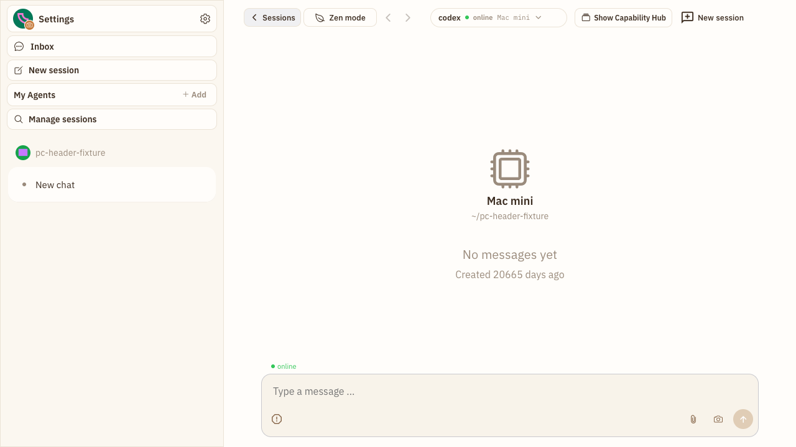
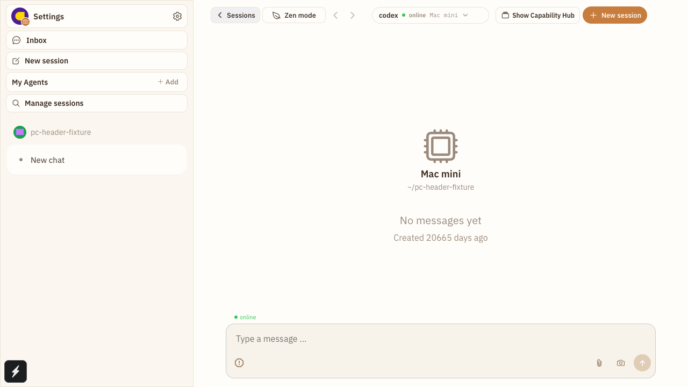
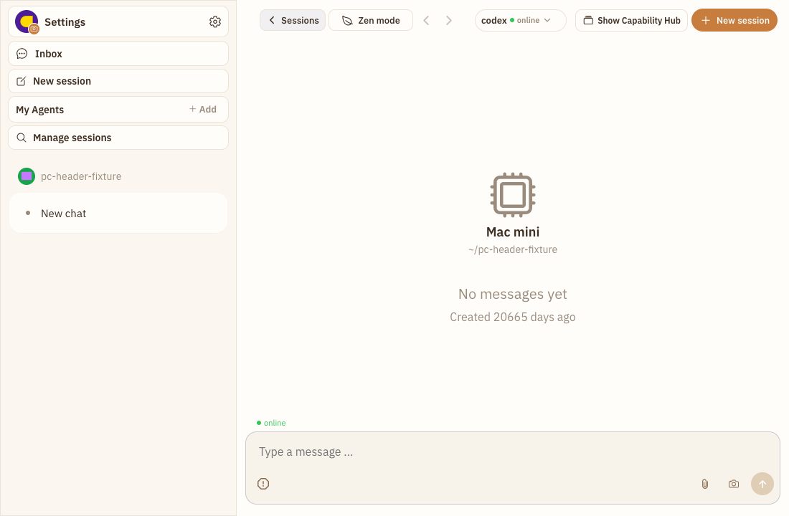

# Batch 24：PC 会话页新建入口视觉收口

> 用户复核 Batch 23 的 `PC-007` 后确认：入口语义已经清楚，但复合“对话框 + 加号”图标仍显厚重。本批次按 PC 交互回归模式重新检查按钮本身和真实会话 Header 的边界布局。

## 一、回归范围

- Case：`PC-007B` 新建会话主操作视觉；`PC-007C` 右栏断点 Header 防拥挤
- 页面状态：真实 `SessionView`，左侧会话栏展开、Capability Hub 收起
- 基线 commit：`7e55259667aac1b4c543173ff42652e39d9c5951`
- 视口：`1280×720`、右栏启用边界 `1100×720`
- 登录态：项目 Playwright Harness 创建的隔离环境
- 工具边界：当前会话没有可用 Browser Control provider；使用仓库既有 Playwright Harness，未将其描述为 Browser Control 成功
- 夹具边界：临时开发路由只负责向 store 注入会话；页面主体、`SessionView`、Header、导航、右栏恢复动作均为生产组件。截图完成后临时路由、E2E Case 和 `video: off` 配置已删除

## 二、修复前问题

1. `message-plus-outline` 同时包含对话框轮廓和加号，线条比相邻动作更厚，视觉重心偏乱。
2. 新建会话是主要动作，却以中性裸图标显示，与描边的 Capability Hub 恢复动作缺少主次。
3. 第一版视觉补丁使用 `10px` 圆角，32px 高按钮仍是圆角矩形，不是真胶囊。
4. 第一版前后图缩放比例不同，无法可信比较图标重量和间距。
5. 真实 `SessionView` 在 `1100px` 右栏启用边界下，会话 Chip 会溢出并压住 Capability Hub 恢复按钮；独立按钮 fixture 没有发现它。

## 三、修复

- 图标改为更轻的 `Ionicons add-outline`（18px），去掉“方框里塞加号”的复合轮廓。
- 新建会话入口使用品牌主色、主按钮前景色和 `16px` 圆角，形成 32px 真胶囊。
- 保留可见 `New session/新建会话` 文案、按钮角色、完整可访问名称、点击反馈和 `/new` 路由。
- 按压状态使用 Unistyles variant；文案强制单行并允许尾部截断。
- `SessionHeaderChip` 受标题槽实际宽度约束；具名布局 helper 在低于 1180px 时隐藏机器名并收紧内边距，但始终保留 Agent、连接状态点和可见 `Online/Offline`，完整机器名仍保留在可访问名称中。

## 四、同尺度前后截图

下图上半部分为修复前、下半部分为修复后；两者均来自同一真实 `SessionView`、同一 `1280×720` CSS 视口、同一 DPR，并使用完全相同的裁剪坐标，没有单独放大任一侧。

完整的修复前页面：

完整的修复后页面：

`1100px` 右栏启用边界的独立同尺度前后组（上为修复前，下为修复后）：

完整的修复前边界页面：

完整的修复后边界页面，四组 Header 控件互不重叠且连接状态仍可见：

## 五、自动化证据

- 单测确认图标为 `add-outline`、尺寸为 `18`，文案单行、可访问名称保留，点击仍导航 `/new`。
- Chip 单测分别覆盖紧凑态 Online 与 Offline：状态文字始终可见，机器名虽隐藏但仍可被辅助技术读取。
- Playwright Harness 在 `1100px`、`1280px` 的真实 `SessionView` 中确认导航、会话 Chip、Capability Hub 恢复动作、新建会话均可见。
- 边界几何断言确认四组 Header 命中区域不相交；浏览器计算样式确认新按钮高度 `32px`、圆角 `16px`、背景非透明、文案不换行。
- 默认 Playwright 配置因本机缺少配套 ffmpeg 在创建页面前失败；按项目既有经验使用未提交的 `video: off` 临时配置运行，产品 Case `2 passed`。

## 六、验证清单

- `SessionView.agentSpace.test.tsx` + `SessionHeaderChip.test.tsx` + `desktopNavigationLayout.test.ts`：`44 passed`
- `pnpm typecheck`：passed
- 真实会话 Header Playwright：修复后 `2 passed`；同尺度 1100px 修复前基线 `1 passed`
- 可见 UI Case：`2`
- 独立截图：同尺度对比 `2` 组、完整页面 `4` 张
