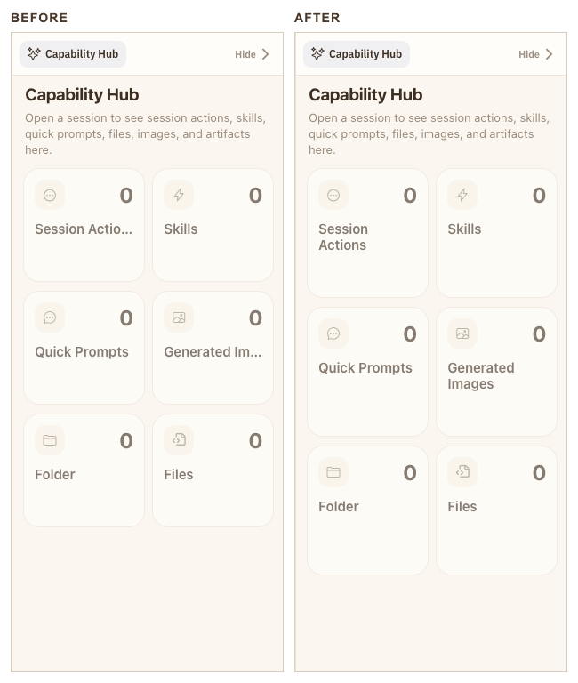
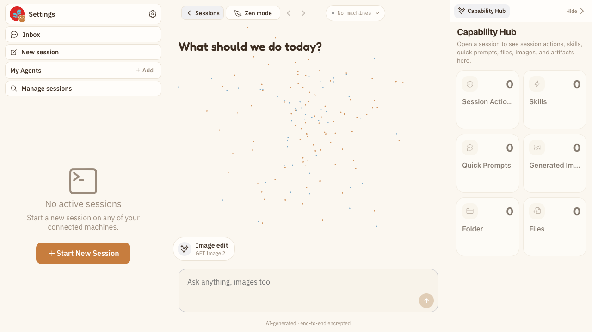
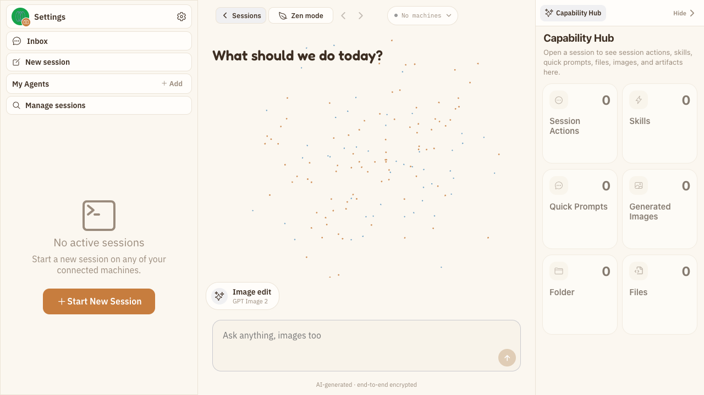
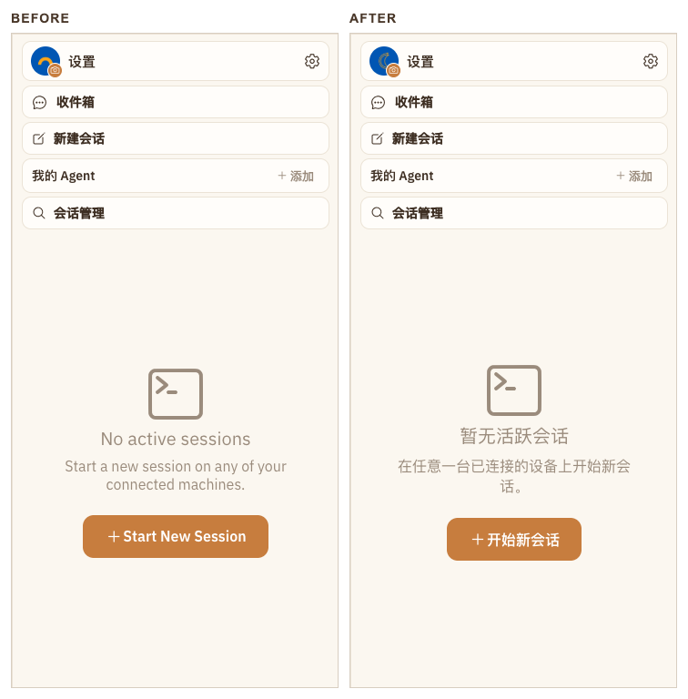
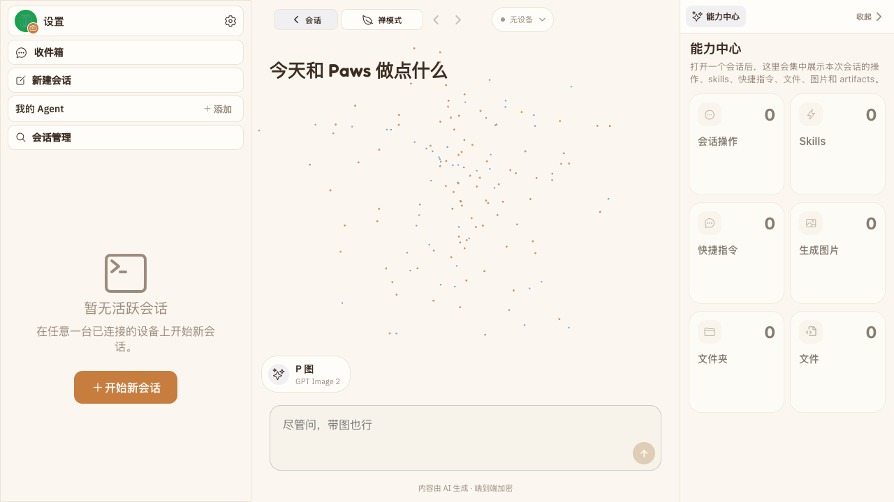

# Batch 25：PC 能力入口与空会话文案收口

> 本批次从最新 `main` 重新冻结核心 PC 工作区基线，修复标准桌面宽度下的能力卡标题省略，以及中文界面中的空会话侧栏中英文混排。

## 一、环境与覆盖

- 基线 commit：`0277eb015df0fe6674ea49b18431e90c4ed129ee`
- worktree：`../happy--visual-walkthrough-20260731`
- branch：`visual-walkthrough-20260731`
- 评审主模式：PC Web 全站交互 E2E 走查（隔离环境限界版）
- 登录态：项目 Playwright Harness 创建的隔离 `authenticated-empty` 环境
- 核心视口：`1024×768`、`1280×720`、`1440×900`、`1920×1080`
- 工具边界：Browser Control provider 不可用；使用仓库 Playwright Harness，未将其描述为 Browser Control 成功
- 状态边界：覆盖新会话工作区、左右栏折叠、Picker、图片样式、命令面板、消息/媒体演示、工具状态与工件空态；真实活跃 Session 和生产已填充列表未使用生产凭据，结论保持证据不足

## 二、Case 账本

| Case ID | 页面/状态 | 修复前问题 | 严重度 | 复现步骤 | 验收标准 | Before | After | 结果 |
| --- | --- | --- | --- | --- | --- | --- | --- | --- |
| PC-010 | `/new`，Capability Hub 展开，英文，`1280×720` / `1440×900` | 常用入口 `Session Actions` 与 `Generated Images` 被省略号截断，卡片语义需要猜测 | P2 | 打开 `/new`，保持右栏展开 | 两档视口下完整可读；两列卡片等高；无横向溢出 | `batch-25-case-01-capability-titles-before-1280x720.png` | `batch-25-case-01-capability-titles-after-1280x720.png` | 已修复 |
| PC-011 | `/new`，左栏无活跃会话，简体中文，`1280×720` | 页面导航与主工作区已中文化，但空会话标题、说明与按钮整块保留英文 | P2 | 以 `zh-CN` 打开 `/new` | 空态标题、在线/离线说明与按钮均来自强类型 i18n；中文页面无该组英文硬编码 | `batch-25-case-02-sidebar-empty-before-1280x720.png` | `batch-25-case-02-sidebar-empty-after-1280x720.png` | 已修复 |

Visible UI cases: 2

## 三、逐 Case 视觉证据

### PC-010：Capability Hub 卡片标题完整可读

下图左右分别为同一 `1280×720` CSS 视口、DPR 1、100% 缩放的修复前与修复后右栏裁切。

### PC-011：中文空会话侧栏不再中英文混排

下图左右分别为同一 `1280×720` CSS 视口、DPR 1、100% 缩放的修复前与修复后左栏裁切。

## 四、验证

- RED：Playwright DOM 尺寸断言确认 `Session Actions` 在 `1280×720` 存在真实水平溢出/省略
- 定向组件测试：`2 files / 5 tests passed`
- 两档 Capability Hub Playwright：`1280×720`、`1440×900` 完整可读并通过 DOM overflow 断言
- 中文空会话 Playwright：标题、在线说明和主按钮均为中文，`1 passed`
- 相关桌面工作区 Playwright：三栏折叠与内容列对齐 `2 passed`
- Happy App typecheck：passed
- `git diff --check`：passed
- 独立回归：PC-010、PC-011 均为“已修复”，路径内新增回归 0；2 个可见 Case 对应 2 组独立前后证据
- 实际 PR 证据检查：待创建 PR 后执行
