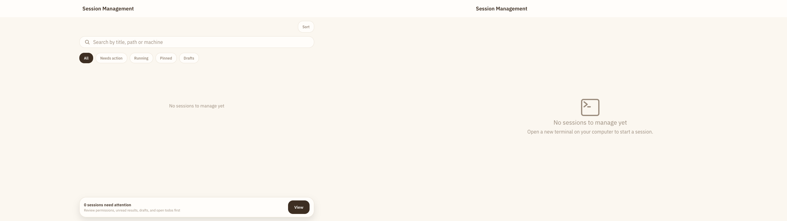
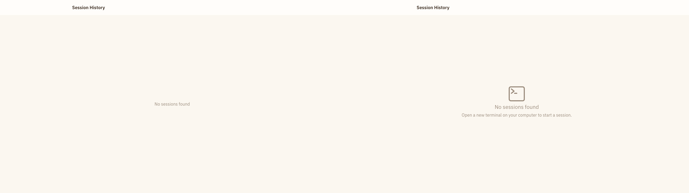
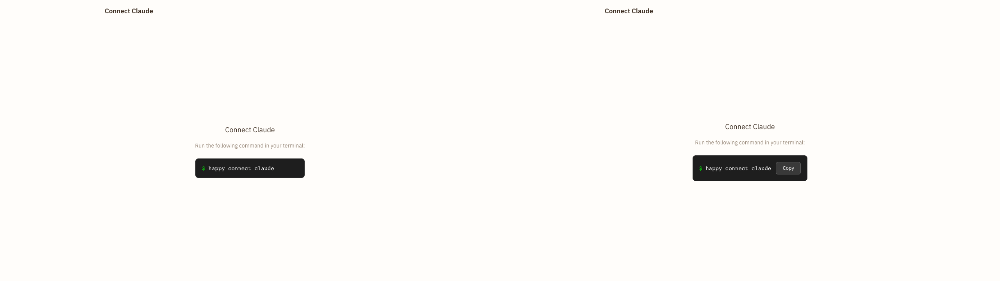
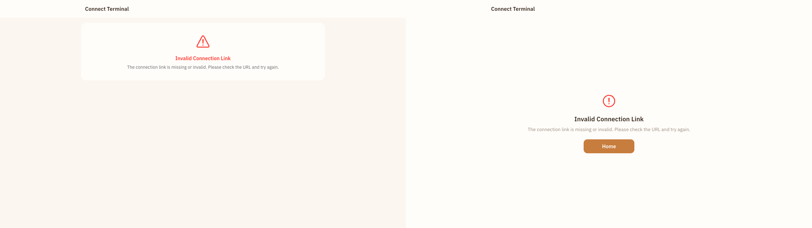
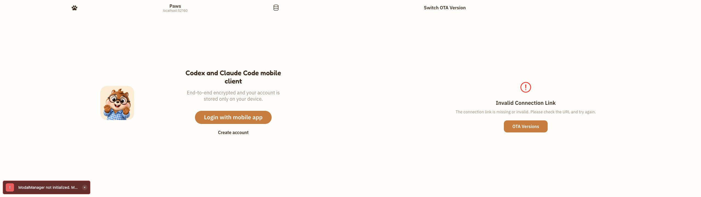
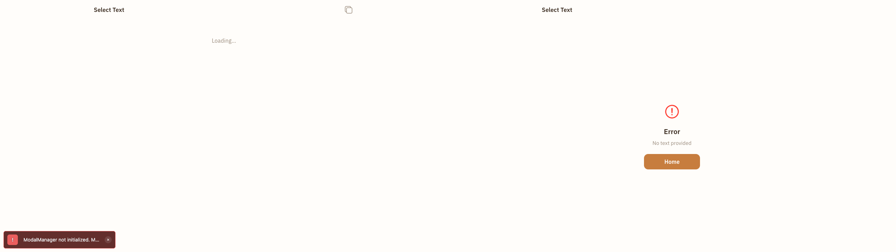

# Batch 26：PC 空态与无效深链恢复

> 本批次从最新 `main` 继续走查此前未完整覆盖的安全路由，冻结空态、错误态、加载态与静态指引中的恢复性问题。

## 一、环境与覆盖

- 基线 commit：`ce4d1141ff6e6c08cc6bfb003b6b4624d10010b9`
- worktree：`../happy--visual-walkthrough-batch-26`
- branch：`visual-walkthrough-batch-26`
- 评审主模式：PC Web 全站交互 E2E 走查（隔离环境限界版）
- 登录态：项目 Playwright Harness 创建的隔离 `authenticated-empty` 环境
- 视口：`1024×768`、`1280×720`、`1440×900`、`1920×1080`
- 基线：7 个安全路由 × 4 视口 = 28 帧；所有样本 `scrollWidth === clientWidth`
- 工具边界：Browser Control 两个同槽位 provider 均不可用；使用仓库 Playwright Harness，未将其描述为 Browser Control 成功
- 状态边界：只覆盖空态、无效深链、加载态和静态指引；已填充列表、活跃会话、有效连接/OTA 链路及文本选择完成态仍为证据不足

## 二、页面 × 状态矩阵

| 页面类型 | 本轮状态 | 结果 | 未覆盖 |
| --- | --- | --- | --- |
| 会话管理 | 0 项 | 修复后通过 | 1 项、典型数量、筛选、排序、超长标题 |
| 会话历史 | 0 项 | 修复后通过 | 已填充历史、滚动、详情返回 |
| Claude 连接 | 静态终端指引 | 修复后通过 | 成功连接、失败/超时 |
| Terminal 连接 | 无效链接 | 修复后通过 | 有效链接、确认/取消、成功连接 |
| OTA switch | 裸路径失败 | 修复后通过 | 有效参数、确认/取消、成功/失败 |
| 文本选择 | 缺少前置参数 | 修复后通过 | loaded、empty、长文本、选择与复制 |

## 三、Case 账本

| Case ID | 页面/状态 | 修复前问题 | 严重度 | 复现步骤 | 验收标准 | Before | After | 结果 |
| --- | --- | --- | --- | --- | --- | --- | --- | --- |
| PC-012 | `/session/search`，0 会话 | 零结果仍显示 `0 sessions need attention` 与强主操作 `View`，动作只切换到同一空白结果 | P3 | 0 会话打开页面并点击 View / Sort | 零会话时不显示无目标筛选、排序和关注底栏；提供能产生数据的下一步 | `batch-26-case-01-session-management-empty-before-1280x720.png` | `batch-26-case-01-session-management-empty-after-1280x720.png` | 已修复 |
| PC-013 | `/session/recent`，0 会话 | 整屏只有 `No sessions found`，没有原因说明和下一步 | P2 | 0 会话打开页面 | 显示结构化空态；在线机器可开始新会话，离线时给出正确提示 | `batch-26-case-02-session-history-empty-before-1280x720.png` | `batch-26-case-02-session-history-empty-after-1280x720.png` | 已修复 |
| PC-014 | `/settings/connect/claude` | 关键终端命令没有可见、可聚焦的复制入口或完成反馈 | P2 | 打开 Claude 连接指引 | 提供具名 Copy 按钮；鼠标和键盘可用；复制后显示短暂反馈 | `batch-26-case-03-connect-claude-copy-before-1280x720.png` | `batch-26-case-03-connect-claude-copy-after-1280x720.png` | 已修复 |
| PC-015 | `/terminal`、`/terminal/connect`，无效链接 | 错误卡只有说明，没有页面内恢复动作 | P2 | 不带连接参数打开任一路由 | 两个别名路由均显示明确返回动作；不依赖浏览器历史猜测恢复路径 | `batch-26-case-04-terminal-invalid-before-1280x720.png` | `batch-26-case-04-terminal-invalid-after-1280x720.png` | 已修复 |
| PC-016 | `/ota-switch`，缺少参数 | 路由回落登录首页并暴露 `ModalManager not initialized` 内部错误 | P2 | 裸路径打开页面 | 保留明确无效链接状态和恢复动作；不跳回无关页面、不显示内部错误 | `batch-26-case-05-ota-switch-invalid-before-1280x720.png` | `batch-26-case-05-ota-switch-invalid-after-1280x720.png` | 已修复 |
| PC-017 | `/text-selection`，缺少参数 | 画面同时显示 `Loading...` 与内部错误 toast，且无恢复路径 | P2 | 裸路径打开页面 | 缺参数时立即显示明确错误与返回动作；没有内部错误和永久加载假象 | `batch-26-case-06-text-selection-invalid-before-1280x720.png` | `batch-26-case-06-text-selection-invalid-after-1280x720.png` | 已修复 |

Visible UI cases: 6

## 四、独立发现

独立评审 Agent 在不知道生产者候选结论的情况下复核 28 帧，确认上述 6 项问题；另将活跃会话、有效深链和完成态列为证据不足，没有把空态路由遍历冒充全站完成。

## 五、逐 Case 视觉证据

以下六组均为同一 `1280×720` CSS 视口、DPR 1、100% 缩放的完整页面；每组左侧为修复前，右侧为修复后。

### PC-012：会话管理零会话状态

### PC-013：会话历史零会话状态

### PC-014：Claude 连接命令复制

### PC-015：Terminal 无效链接恢复

### PC-016：OTA switch 无效链接恢复

### PC-017：文本选择缺参数恢复

## 六、验证

- 定向 Vitest：`5 files / 13 tests passed`
- Playwright 四档视口：6 个修复状态 × 4 视口 = 24 帧；全部无横向溢出，且不再出现 `ModalManager not initialized`
- Playwright 恢复动作：Claude Copy 可由键盘触发并显示 `Copied`；Terminal Home、OTA Versions、Text Selection Home 均导航到确定目标
- 会话空态：隔离环境离线机器分支显示明确终端提示；单测另覆盖在线机器的 `/new` 导航与非零会话原路径
- 有效链接回归：单测保留 OTA preview 确认/应用、Terminal query/hash 连接、Text Selection 有效内容读取
- 首次集成回归发现放在 Expo Router `app/` 下的测试会被 Metro 当页面打包；测试已移至 `sources/components/` 后同一浏览器回归通过
- Happy App typecheck：最终集成通过
- `git diff --check`：最终集成通过
- 官方桌面 E2E 相关回归：3 项通过（侧栏控件、三栏折叠/Zen、欢迎区与输入框对齐）
- 独立回归：PC-012～PC-017 共 6 项全部通过，无失败、证据不足或新增回归
- 证据边界：PC-015 的四档浏览器截图与点击来自 `/terminal/connect`；`/terminal` 别名由直接代码检查和组件测试覆盖
