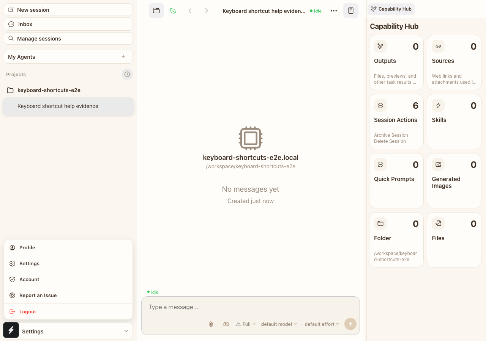
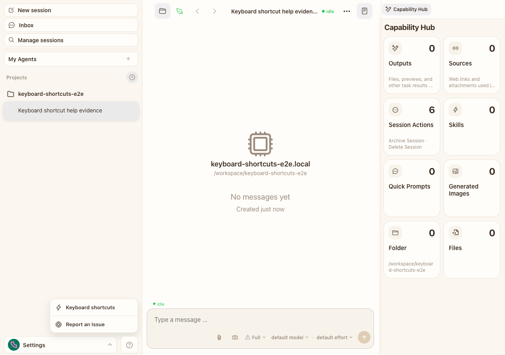
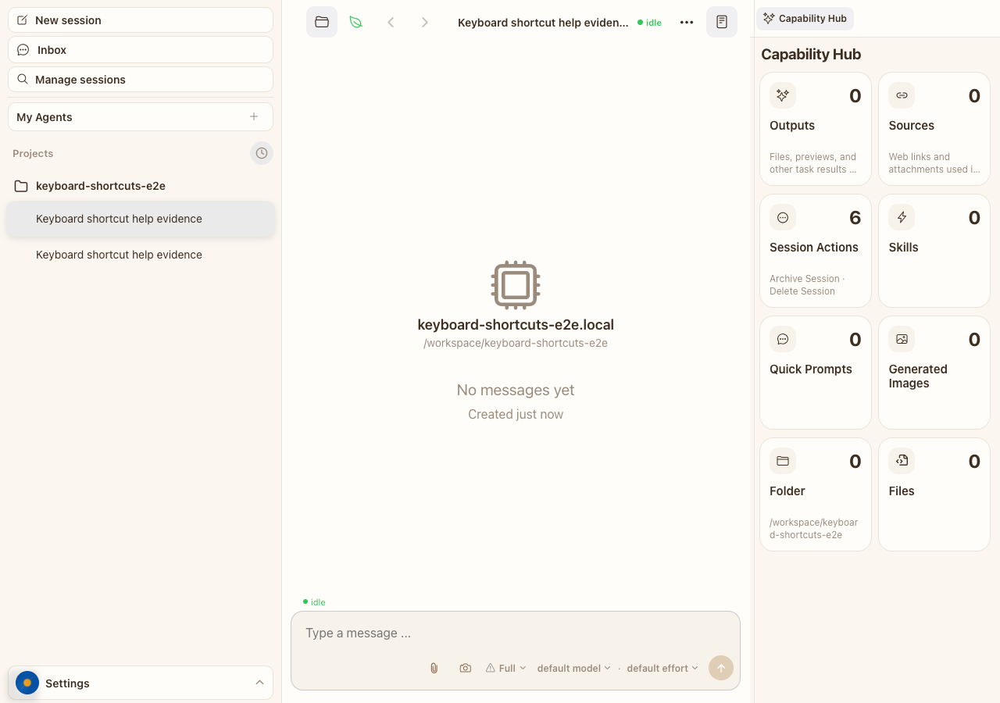
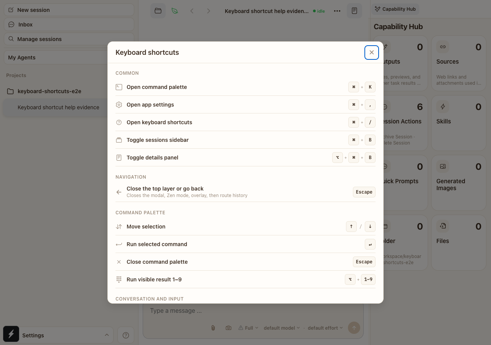

# Keyboard shortcuts help — visual evidence

- Visible UI cases: 2
- Viewport: `1280 × 900`, DPR 1
- Browser: Playwright Chrome
- Environment: isolated local `authenticated-empty` E2E environment; no production connection or model request

| Case | Problem | Before | After | Runtime assertions |
| --- | --- | --- | --- | --- |
| KH-01 — discoverable sidebar help | Reporting an issue lived inside the account menu; there was no dedicated shortcut reference entry. |  |  | The `?` trigger exposes a menu, launches the reference panel, and restores focus after close. |
| KH-02 — Web shortcut reference | `Ctrl` / `⌘` + `/` had no visible reference panel, so browser users had no in-app route around reserved `⌘ ,`. |  |  | `Ctrl + /` and `⌘ + /` open the panel; its catalog includes `⌘ ,` for app settings and `⌘ /` for this reference. |

## Reproduction

Baseline (`origin/main` with the same E2E Spec):

```bash
HAPPY_KEYBOARD_SHORTCUTS_HELP_EVIDENCE_PHASE=before \
HAPPY_KEYBOARD_SHORTCUTS_HELP_EVIDENCE_DIR=<evidence-dir> \
pnpm test:e2e:web -- --grep '\\[KEYBOARD-SHORTCUTS-HELP\\]'
```

Feature branch:

```bash
HAPPY_KEYBOARD_SHORTCUTS_HELP_EVIDENCE_PHASE=after \
HAPPY_KEYBOARD_SHORTCUTS_HELP_EVIDENCE_DIR=<evidence-dir> \
pnpm test:e2e:web -- --grep '\\[KEYBOARD-SHORTCUTS-HELP\\]'
```

The same `KH-02` Case was rerun with `HAPPY_E2E_RECORD=1`. Its stable delivery artifact is `kh-02-shortcut-reference.mp4` (H.264, yuv420p, 1280×720, 25 fps, 9.04 s); it completed an `ffprobe`, full decode, and contact-sheet visual review.
